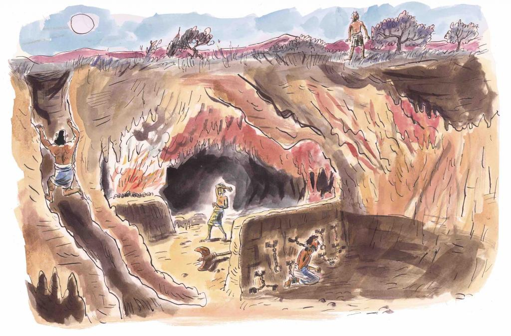

<!--
_backgroundColor: black
_color: white
-->

# **Marp**

Markdown Presentation Ecosystem

https://marp.app/

---

# images

Marp permet également une gestion assez fine des images. Par défaut, une image sera affichée à 100 % de sa taille originale et alignée à gauche. 
Pour la redimensionner à x45 % et la centrer, c’est comme ceci :

---

---

Pour mettre une image en fond de votre slide, c’est comme ceci :

---

---

Si vous voulez que l’image ne soit pas adaptée aux dimensions de votre slide, optez pour :

---

