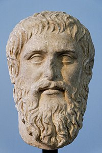

# Titre présentation  <!-- fit -->

Platon a deux frères, Adimante de Collytos et Glaucon, sans doute plus jeunes que lui11, ainsi qu'une sœur, Pôtonê (mère de Speusippe, successeur de Platon à la tête de l’Académie8). La mère de Platon, veuve quelque temps après sa naissance, se remarie avec son oncle maternel, Pyrilampe. La mère de Platon, veuve quelque temps après sa naissance, se remarie avec son oncle maternel, Pyrilampe. 

---

## Diapo 1
> extrait de texte, citation

---

## Diapo 2 : image

#### Buste de Platon

Diapo suivante: image seule

---

---

# Pour passer en 2 colonnes :

#
