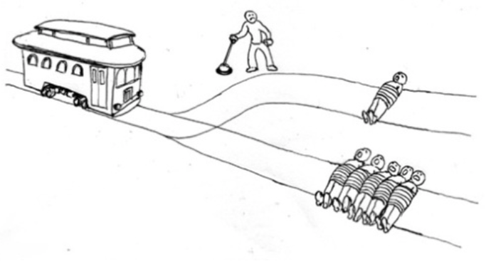
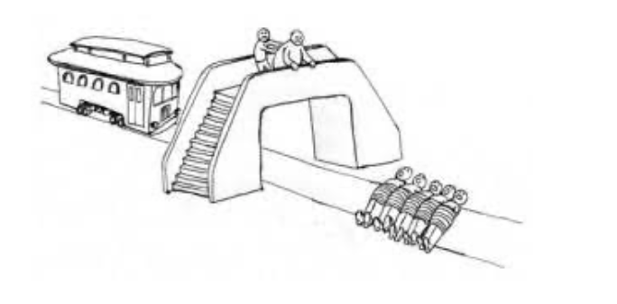

# Exercice d’application n°2 : le dilemme du tramway
{: .no_toc }

  

    Sommaire
  

  {: .text-delta }
- TOC
{:toc}

## Le dilemme du tramway en vidéos

### Explication du dilemme

<iframe width="560" height="315" src="https://www.youtube.com/embed/Ydr-WWpcT70?si=lJMvS5YHb7uIO5ui" title="YouTube video player" frameborder="0" allow="accelerometer; autoplay; clipboard-write; encrypted-media; gyroscope; picture-in-picture; web-share" referrerpolicy="strict-origin-when-cross-origin" allowfullscreen></iframe>

### Le dilemme du tramway : Jusqu'où serez-vous utilitariste ?

<iframe width="560" height="315" src="https://www.youtube.com/embed/AZBDMN5wZ-8?si=YBSBwOoxPAUgA5SL" title="YouTube video player" frameborder="0" allow="accelerometer; autoplay; clipboard-write; encrypted-media; gyroscope; picture-in-picture; web-share" referrerpolicy="strict-origin-when-cross-origin" allowfullscreen></iframe>

### Le dilemme du tramway dans la série *The Good Place*

#### Extrait de la série

<iframe width="560" height="315" src="https://www.youtube.com/embed/DtRhrfhP5b4?si=kjYirX3ot454PBxe" title="YouTube video player" frameborder="0" allow="accelerometer; autoplay; clipboard-write; encrypted-media; gyroscope; picture-in-picture; web-share" referrerpolicy="strict-origin-when-cross-origin" allowfullscreen></iframe>

#### Le "dilemme du tramway" expliqué par Michael Schur, créateur de "The Good Place"

<iframe width="560" height="315" src="https://www.youtube.com/embed/5U6CG23rbG0?si=55VVtT5L9f087bIh" title="YouTube video player" frameborder="0" allow="accelerometer; autoplay; clipboard-write; encrypted-media; gyroscope; picture-in-picture; web-share" referrerpolicy="strict-origin-when-cross-origin" allowfullscreen></iframe>

## Activité : Comment résoudre le dilemme du tramway ?

**Une expérience de pensée, en philosophie, est une situation imaginaire qui permet de poser un problème, de tester des thèses philosophiques**.

{: .highlight }
>La philosophe Philippa Foot a imaginé en 1967 une expérience de pensée qui deviendra célèbre : **l'expérience du tramway fou**. Son scénario est le suivant : **le conducteur d’un tramway dont les freins ont lâché fonce vers une voie où travaillent cinq ouvriers ; il a la possibilité de dévier le tramway vers une voie où ne travaille qu’un seul ouvrier.** Que feriez-vous à sa place ? Ce dilemme du tramway de Philippa Foot a été adapté de très nombreuses fois et même testé sous forme de sondages. Sa version classique nous place devant un poste d’aiguillage : c’est nous qui allons décider si nous devons dévier le tramway vers la voie où il n’y a qu’un seul ouvrier, afin d’en sauver cinq.
>
>Une autre philosophe, Judith Jarvis Thomson, modifie ce scénario pour en approfondir le dilemme moral. Imaginons que nous soyons sur un pont, au-dessus d’un tramway incontrôlable qui fonce vers cinq ouvriers. Il y a à côté de nous un homme obèse. En le poussant par-dessus le pont, il fera dérailler le tramway et sauvera les cinq ouvriers. Que ferons-nous ? Cette situation a ceci de différent avec la première que, pour sauver cinq vies, nous devons assassiner quelqu’un, de nos propres mains, alors que dans la première situation, nous avons juste à actionner un mécanisme, celui du poste d’aiguillage.
>
>Ces situations, même si elles ne sont pas réalistes, ont le mérite d'interroger les principes du conséquentialisme. **Est-ce que la fin justifie les moyens ? Peut-on sacrifier une personne pour en sauver cinq, par exemple ?**

| Première version du dilemme du tramway :   | Seconde version du dilemme du tramway : |
| ---------------------------- | ------------------------ |
| 

 | 

  |

{: .note-title }
> Exercice
>
> Expliquez ce que feraient dans la situation du tramway fou et quels seraient les arguments de : (1) un utilitariste ,(2) un déontologiste, (3) un partisan de l'éthique des vertus.

|                        | **Que fait-il ?** | **Comment le justifie-t-il ?** |
| ---------------------- | ----------------- | --------------------- |
| **Utilitarisme** |           |                |
| **Déontologisme** |               |             |
| **Éthique des vertus** |           |          |