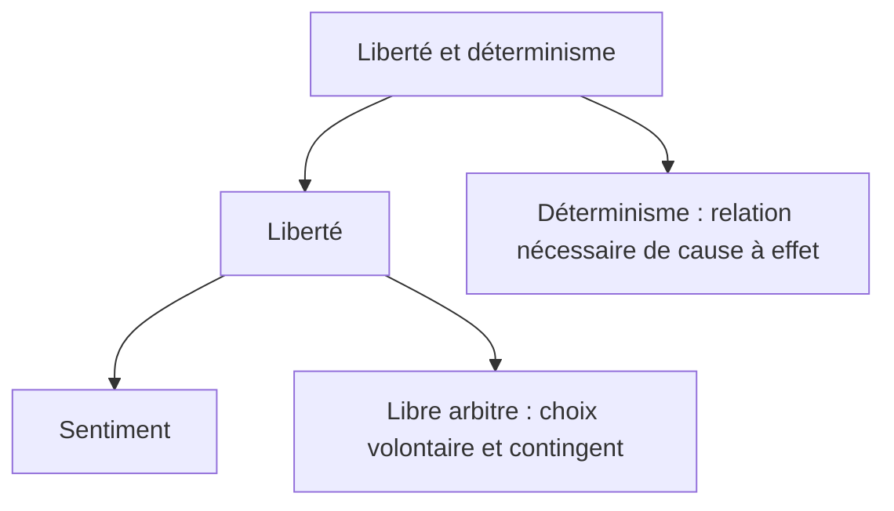

## a) Liberté et déterminisme
{: .no_toc }

  

    Sommaire
  

  {: .text-delta }
- TOC
{:toc}

### Définitions

{: .note-title }
> Libre arbitre 
>
> **Pouvoir de décider** : 
> - **avoir le choix** (plusieurs possibilités qui se présentent à nous avant d’agir) ; 
>- ... et **agir volontairement**, **être la cause première de ses actes** (être soi-même l’auteur de ses actions). 
>
>A l’inverse, si une cause qui échappe à notre volonté est à l’origine de notre action, nous n’avons pas agi librement. Nous dirons alors que nous avons été **déterminé** ou **contraint** à agir.

{: .nouveau-title }
> Déterminisme
>
>On parle de **déterminisme** quand certaines **causes** entraînent des effets **nécessaires**, des effets qui ne pouvaient pas ne pas avoir lieu. Par exemple, si la température de l’eau atteint 100° à 0 mètres d’altitude (cause), elle boue (effet).
>
>Le déterminisme affirme donc que **les événements sont nécessaires et réguliers** :
>- Tout a une cause (quelque chose a produit l’ébullition de l’eau)
>- Les causes produisent des effets nécessaires (l’eau qui atteint 100 degrés Celsius produit nécessairement l’ébullition de H2O)
>- Les mêmes causes produisent les mêmes effets (L’eau bout toujours à 100 ° dans les mêmes conditions)
>
>**Le problème est de savoir quels événements sont concernés par le déterminisme : seulement les faits naturels, ou aussi ceux qui concernent les êtres humains ?**

### Schéma sur la liberté et le déterminisme

[→ Ouvrir le schéma détaillé](https://rollauda.github.io/schemas/cartes/liberte-determinisme.html){:target="_blank" } 

### Vidéos : liberté et déterminisme

#### Extrait du film d'animation "Waking Life"

{: .highlight }
>**Waking Life** est un film d'animation de 2001 réalisé par Richard Linklater. Le spectateur y suit un jeune homme qui évolue dans un état de rêve lucide dans lequel il participe à diverses conversations philosophiques avec les personnages qu’il rencontre. Les thèmes sont : la réalité, le libre arbitre, la relation aux autres, le sens de la vie, etc. Au cours du film, le jeune homme s’interroge sur son impossibilité à se réveiller de ce rêve. Il en vient à penser que cela est peut-être dû au fait qu’il est mort.  
> 1. Les désirs du personnage en prison vous semblent-ils libres ? Pourquoi ?
> 2. Qu’est-ce que le problème ou « dilemme » du libre arbitre selon le professeur ?

<iframe src="https://drive.google.com/file/d/1HIJ-oM1O04J6Z9y-OUlEp9gffkV7_I4f/preview" width="560" height="315" allow="autoplay"></iframe>

#### Coursitout : libres ou déterminés ?

<iframe width="560" height="315" src="https://www.youtube.com/embed/q_4JidAM9PM?si=c3QKE8q94eQKQSAO" title="YouTube video player" frameborder="0" allow="accelerometer; autoplay; clipboard-write; encrypted-media; gyroscope; picture-in-picture; web-share" referrerpolicy="strict-origin-when-cross-origin" allowfullscreen></iframe>

### Le démon de Laplace

> « *Une Intelligence qui pour un instant donné, connaîtrait toutes les forces dont la nature est animée, et la situation respective des êtres qui la composent (...) embrasserait dans la même formule les mouvements des plus grands corps de l'univers et ceux du plus léger atome : rien ne serait incertain pour elle, et l'avenir comme le passé, serait présent à ses yeux.* »   
>(Pierre-Simon Laplace, *Essai philosophique sur les probabilités*, 1825)

***Le hasard existe-t-il ?* Une longue vidéo (17mn) de présentation des thèse de Pierre-SImon Laplace**  

<iframe width="560" height="315" src="https://www.youtube.com/embed/ineA65nJ9Ds?si=qAjNqxqI8UxNz_mt" title="YouTube video player" frameborder="0" allow="accelerometer; autoplay; clipboard-write; encrypted-media; gyroscope; picture-in-picture; web-share" referrerpolicy="strict-origin-when-cross-origin" allowfullscreen></iframe>