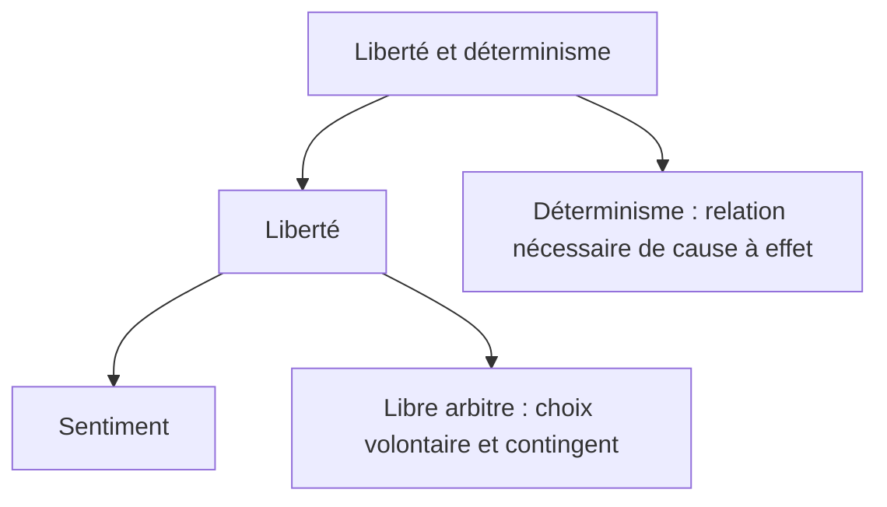

## Liberté et déterminisme
{: .no_toc }

  

    Sommaire
  

  {: .text-delta }
- TOC
{:toc}

### Schéma sur la liberté et le déterminisme

[→ Ouvrir le schéma détaillé](https://rollauda.github.io/schemas/cartes/liberte-determinisme.html){:target="_blank" } 

### Vidéos : liberté et déterminisme

#### Extrait du film d'animation "Waking Life"

{: .highlight }
>**Waking Life** est un film d'animation de 2001 réalisé par Richard Linklater. Le spectateur y suit un jeune homme qui évolue dans un état de rêve lucide dans lequel il participe à diverses conversations philosophiques avec les personnages qu’il rencontre. Les thèmes sont : la réalité, le libre arbitre, la relation aux autres, le sens de la vie, etc. Au cours du film, le jeune homme s’interroge sur son impossibilité à se réveiller de ce rêve. Il en vient à penser que cela est peut-être dû au fait qu’il est mort.  
> 1. Les désirs du personnage en prison vous semblent-ils libres ? Pourquoi ?
> 2. Qu’est-ce que le problème ou « dilemme » du libre arbitre selon le professeur ?

<iframe src="https://drive.google.com/file/d/1HIJ-oM1O04J6Z9y-OUlEp9gffkV7_I4f/preview" width="560" height="315" allow="autoplay"></iframe>

#### Coursitout : libres ou déterminés ?

<iframe width="560" height="315" src="https://www.youtube.com/embed/q_4JidAM9PM?si=c3QKE8q94eQKQSAO" title="YouTube video player" frameborder="0" allow="accelerometer; autoplay; clipboard-write; encrypted-media; gyroscope; picture-in-picture; web-share" referrerpolicy="strict-origin-when-cross-origin" allowfullscreen></iframe>

### Le démon de Laplace

***Le hasard existe-t-il ?* Une longue vidéo (17mn) de présentation des thèse de Pierre-SImon Laplace**  

<iframe width="560" height="315" src="https://www.youtube.com/embed/ineA65nJ9Ds?si=qAjNqxqI8UxNz_mt" title="YouTube video player" frameborder="0" allow="accelerometer; autoplay; clipboard-write; encrypted-media; gyroscope; picture-in-picture; web-share" referrerpolicy="strict-origin-when-cross-origin" allowfullscreen></iframe>