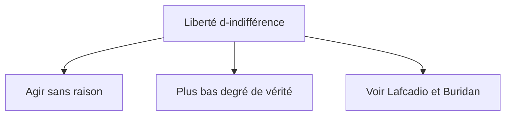
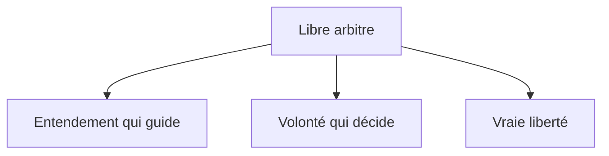

## c) La liberté, ce n’est pas être libre de tout faire
{: .no_toc }

  

    Sommaire
  

  {: .text-delta }
- TOC
{:toc}

### Le paradoxe de L'âne de Buridan

{: .highlight }
Le paradoxe de l'âne Buridan est une expérience de pensée qui a traversé l'histoire de la philosophie, mettant en scène un âne situé à égal distance entre un seau d'eau et un seau d'avoine, mais qui étant simultanément tiraillé par la faim et la soif, n'arrive pas à choisir vers lequel de ces deux sceaux il pourrait se diriger, si bien qu'il finit par mourir sur place de soif et de faim.   
Cette petite histoire absurde permet d'interroger l'existence d'un type de liberté absolue, la **liberté d'indifférence**, reposant sur l'indifférence entre les choix qui se présentent à nous.

#### Dans la série "The Big Bang Theory"

<iframe width="560" height="315" src="https://www.youtube.com/embed/uPWsirNBzhs?si=DJ3T3INHQ6kkPCo4" title="YouTube video player" frameborder="0" allow="accelerometer; autoplay; clipboard-write; encrypted-media; gyroscope; picture-in-picture; web-share" referrerpolicy="strict-origin-when-cross-origin" allowfullscreen></iframe>

#### Vidéo explicative (11 mn)

<iframe width="560" height="315" src="https://www.youtube.com/embed/v5hNtp72Gcc?si=ksdIyiGOA-mln2AF" title="YouTube video player" frameborder="0" allow="accelerometer; autoplay; clipboard-write; encrypted-media; gyroscope; picture-in-picture; web-share" referrerpolicy="strict-origin-when-cross-origin" allowfullscreen></iframe>

### Schéma : liberté d'indifférence et libre arbitre (Descartes)

  

[→ Ouvrir le schéma détaillé](https://rollauda.github.io/schemas/cartes/liberte-indifference.html){:target="_blank" } 

