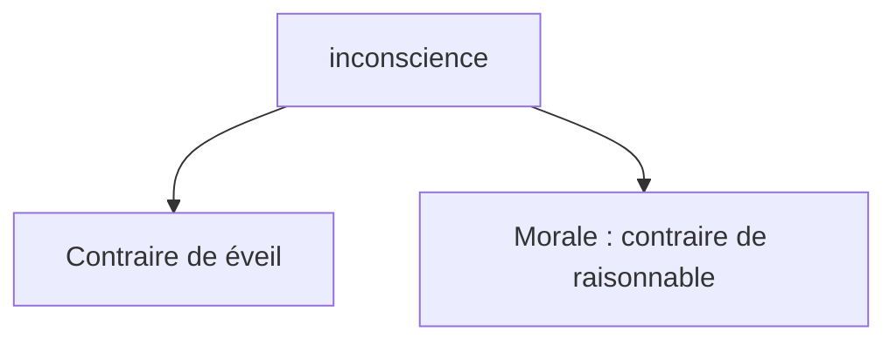
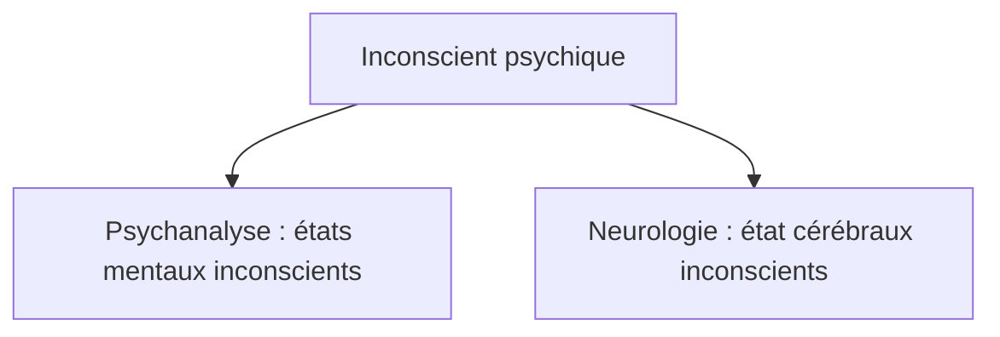
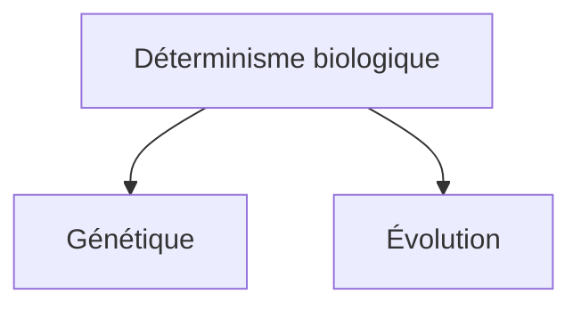
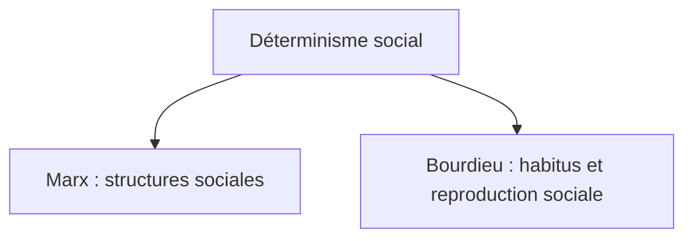
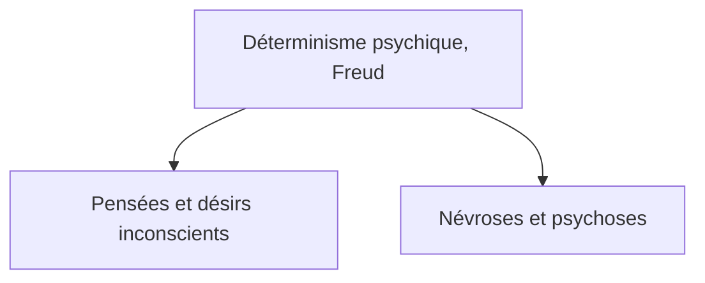

# 1. Des causes inconscientes nous empêchent d’être libres
{: .no_toc }

  

    Sommaire
  

  {: .text-delta }
- TOC
{:toc}

## Schéma : l'inconscient

[→ Ouvrir le schéma détaillé](https://rollauda.github.io/schemas/cartes/inconscient.html){:target="_blank" } 

## Schéma : les déterminismes inconscients

[→ Ouvrir le schéma détaillé](https://rollauda.github.io/schemas/cartes/determinisme-ics.html){:target="_blank" } 

## Complément : J.-F. Dortier, « Nos trois inconscients »

**Chapitre du livre de J.-F. Dortier, « *Nos trois inconscients* » (extrait du livre « Le cerveau et la pensée »)**   

{% pdf "../../assets/pdf/L12/dortier.pdf" width=100% height=700px no_link %} 

