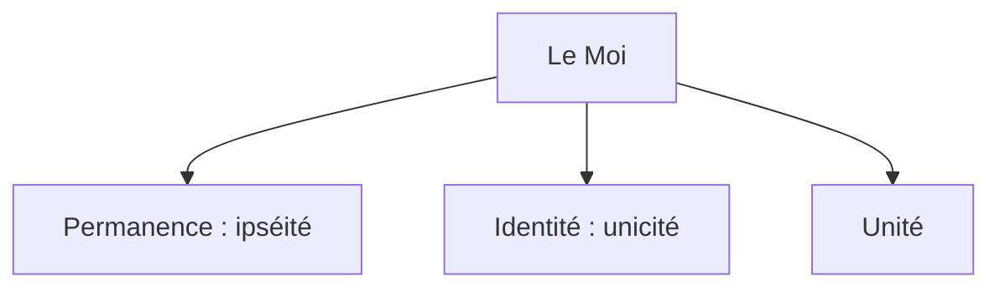

## 1.3. Le déterminisme psychique
{: .no_toc }

  

    Sommaire
  

  {: .text-delta }
- TOC
{:toc}

### Remise en cause de la transparence du Moi

#### Qui est maître dans la maison ?

{: .highlight }
>> « _Le moi n'est pas maître dans sa propre maison._ »  
>> Sigmund Freud, _Essais de psychanalyse appliquée_ (1917)  
>
>Dans cette citation, Freud remet en question une vieille idée : le Moi conscient serait maître dans son corps (sa « *maison* » ). Cela signifie que la conscience est une puissance qui permet à l’être humain de lutter contre les passions du corps, contre les pulsions. Mais en réalité, pour Freud, le Moi n’est pas le maître : car il y a dans notre psychisme un *Inconscient* qui décide à notre place.

#### Schéma : les caractéristiques classiques du "Moi"

[→ Ouvrir le schéma détaillé](https://rollauda.github.io/schemas/cartes/moi.html){:target="_blank" } 

### La psychanalyse