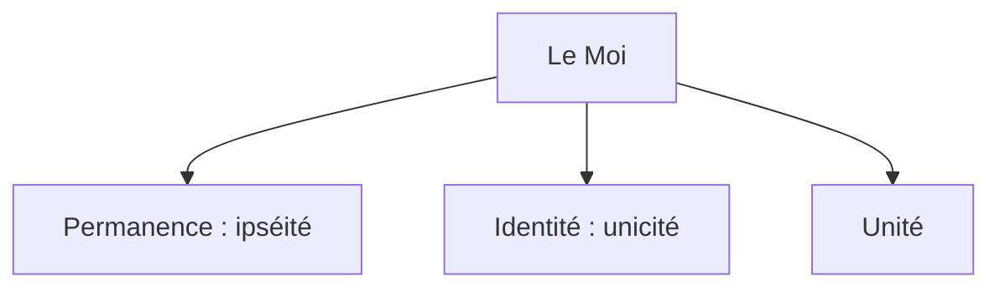

## 1.3. Le déterminisme psychique
{: .no_toc }

  

    Sommaire
  

  {: .text-delta }
- TOC
{:toc}

### Remise en cause de la transparence du Moi

#### Qui est maître dans la maison ?

{: .highlight }
>> **« _Le moi n'est pas maître dans sa propre maison._ »**  
>> Sigmund Freud, _Essais de psychanalyse appliquée_ (1917)  
>
>Dans cette citation, Freud remet en question une vieille idée : le Moi conscient serait maître dans son corps (sa « *maison* » ). Cela signifie que la conscience est une puissance qui permet à l’être humain de lutter contre les passions du corps, contre les pulsions. Mais en réalité, pour Freud, le Moi n’est pas le maître : car il y a dans notre psychisme un *Inconscient* qui décide à notre place.

#### Schéma : les caractéristiques classiques du "Moi"

[→ Ouvrir le schéma détaillé](https://rollauda.github.io/schemas/cartes/moi.html){:target="_blank" } 

### La psychanalyse

{: .important-title }
> QUI ÉTAIT SIGMUND FREUD ?
>
> **Sigmund Freud (1856 – 1939) est un neurologue autrichien et le fondateur de la *Psychanalyse*, qu’il présente comme la science de l’Inconscient et comme une thérapie guérissant les troubles mentaux.** 
>
> La psychanalyse repose sur l’hypothèse de la présence en nous d’un *Inconscient psychique* qui déterminerait nos choix sans que nous le sachions.  
>Ce déterminisme psychique postule que **tous les comportements, pensées et émotions humaines ont pour cause des processus inconscients**.  
> Nos choix seraient le résultat d’une lutte entre : 
>- d’un côté des désirs inconscients immoraux et sauvages (*Eros* : pulsions sexuelles, et *Thanatos* : pulsions de mort ; ces pulsions se développent dans notre enfance sous la forme du complexe d’Œdipe : désir incestueux et désir de parricide ou de matricide, qui finira par être refoulé, oublié) ;
>- et, d’un autre côté, les exigences inconscientes de la civilisation (sortir de la sauvagerie pour vivre en société : interdiction universelle  de l’inceste et du parricide). 
>
>**Cela a pour conséquence que, pour Freud, rien dans le comportement humain n'est réellement libre, aucun comportement n’a pour cause notre volonté consciente, mais que nos actions sont toujours motivées par des désirs inconscients et des conflits refoulés.** 

#### Freud et l'invention de la psychanalyse

<iframe width="560" height="315" src="https://www.youtube.com/embed/jWsP4g6yekU?si=R0PS9oasNGLBUNVj" title="YouTube video player" frameborder="0" allow="accelerometer; autoplay; clipboard-write; encrypted-media; gyroscope; picture-in-picture; web-share" referrerpolicy="strict-origin-when-cross-origin" allowfullscreen></iframe>

#### La cas Anna O.

<iframe width="560" height="315" src="https://www.youtube.com/embed/ssN-4DVd_bM?si=rM_PkTVJPS2Cttvn" title="YouTube video player" frameborder="0" allow="accelerometer; autoplay; clipboard-write; encrypted-media; gyroscope; picture-in-picture; web-share" referrerpolicy="strict-origin-when-cross-origin" allowfullscreen></iframe>

### COMPLÉMENT N°1 : La psychanalyse selon John Huston et Jean Paul Sartre

{: .highlight }
En se livrant à « l'analyse » d'une séquence, Bernard Benoliel revient sur le film "*Freud, passions secrètes*" (1962). À la fin des années 1950, John Huston, cinéaste passionné d'aventures et d'exploration, a une idée doublement iconoclaste : consacrer un film de fiction au jeune Sigmund Freud, et en confier le scénario à... Jean-Paul Sartre, le philosophe de l'existentialisme qui avait pourtant dit et écrit ne pas croire à l'inconscient, et qui étonnamment accepte la proposition. Dans Freud, passions secrètes, Montgomery Clift incarnera le rôle du jeune homme de sciences qui, au cours de la période « héroïque » des débuts, à la fois seul, incompris et névrosé, hésitant et déterminé, va recourir à l'hypnose avant d'inventer, à la fin du XIXème siècle, une méthode inédite pour accéder à ce qui échappe à la conscience de l'homme et, en même temps, le détermine.

<iframe width="560" height="315" src="https://www.youtube.com/embed/5djVTdZaQp8?si=OoMH8nzDhWc5qtug" title="YouTube video player" frameborder="0" allow="accelerometer; autoplay; clipboard-write; encrypted-media; gyroscope; picture-in-picture; web-share" referrerpolicy="strict-origin-when-cross-origin" allowfullscreen></iframe>  

**Voir le film "Freud, passion secrète" (version doublée en français)**   

 <iframe style="width:80%;height:80%;position:absolute;left:0px;top:0px;overflow:hidden" frameborder="0" type="text/html" src="https://www.dailymotion.com/embed/video/xssabw" width="80%" height="80%" allowfullscreen title="Dailymotion Video Player" > </iframe> 

### COMPLÉMENT N°2 : Gilles deleuze et la psychanalyse

**Une critique de la psychanalyse et une conception "ouverte" du désir : Gille deleuze, *Abécédaire*, "D comme désir".**  

<iframe width="560" height="315" src="https://www.youtube.com/embed/tLlSRFLThYw?si=nfDbaEpy_DW5FffP" title="YouTube video player" frameborder="0" allow="accelerometer; autoplay; clipboard-write; encrypted-media; gyroscope; picture-in-picture; web-share" referrerpolicy="strict-origin-when-cross-origin" allowfullscreen></iframe>

