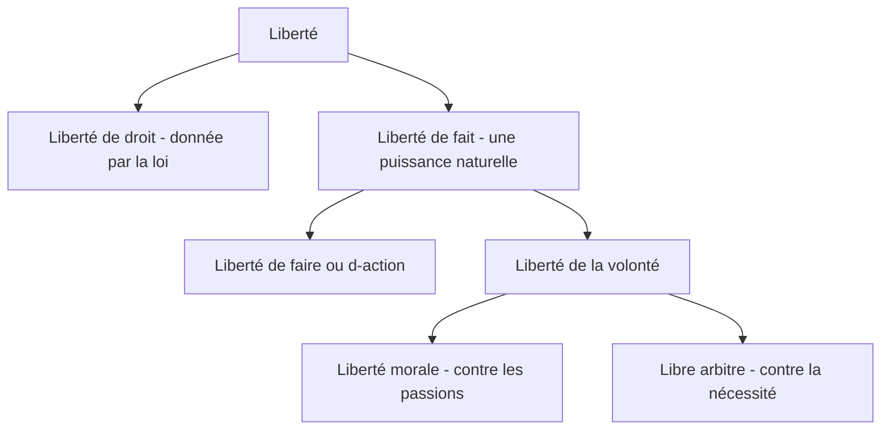

# Conclusion : les différents genres de liberté
{: .no_toc }

  

    Sommaire
  

  {: .text-delta }
- TOC
{:toc}

## Texte de Leibniz sur les différents genres de liberté

| Gottfried Wilhelm Leibniz,  _Nouveaux Essais sur l’entendement humain_ (1704) |
| ---------------------------------------- |
| *Les [numéros] ont été ajoutés pour correspondre au schéma explicatif*      |
| Le terme de liberté est fort ambigu. Il y a **liberté de droit** [1.] et **de fait** [2.]. Suivant celle de droit, un esclave n’est point libre, un sujet n’est pas entièrement libre, mais un pauvre est aussi libre qu’un riche.   La liberté de fait consiste ou dans **la puissance de faire** [3.] ce que l’on veut ou dans **la puissance de vouloir** [4.] comme il faut. [...] La **liberté de faire** [3] a ses degrés et variétés. Généralement, celui qui a plus de moyens est plus libre de faire ce qu’il veut. Mais on entend la liberté particulièrement de l’usage des choses qui ont coutume d’être en notre pouvoir, et surtout de l’usage libre de notre corps. Ainsi la prison et les maladies qui nous empêchent de donner à notre corps et à nos membres le mouvement que nous voulons, et que nous pouvons leur donner ordinairement dérogent à notre liberté : c’est ainsi qu’un prisonnier n’est point libre, et qu’un paralytique n’a point l’usage libre de ses membres.   **La liberté de vouloir [4] est encore pris en deux sens différents**. L’un [5] est quand on l’oppose à l’imperfection ou à l’esclavage d’esprit, qui est une contrainte, mais interne, comme celle qui vient des passions. L’autre sens [6] a lieu quand on oppose la liberté à la nécessité. Dans le premier sens [5], les stoïciens disaient que le sage seul est libre ; et, en effet, on n’a point l’esprit libre quand il est occupé d’une grande passion, car on ne peut point vouloir comme il faut, c’est-à-dire avec la délibération qui est requise. (...)   Mais la liberté de l’esprit opposée à la nécessité [6] regarde la volonté nue (...). C’est ce qu’on appelle le franc-arbitre [libre-arbitre, [6]] et consiste en ce que l’on veut que les plus fortes raisons ou impressions que l’entendement présente à la volonté n’empêchent point l’acte de la volonté d’être contingent et ne lui donnent point une nécessité absolue et pour ainsi dire métaphysique. |

## Schéma explicatif

[→ Ouvrir le schéma détaillé](https://rollauda.github.io/schemas/cartes/liberte-leibniz.html){:target="_blank" }

## Explication détaillée

{: .highlight }
1. **La *liberté de droit* est une liberté formelle** : c’est l’autorisation juridique (par la loi civile) d’accomplir certains actes. Sont privés de cette liberté ceux qui n’ont pas de droits (l’esclave par exemple). De plus, dire que « *tous les hommes naissent libres et égaux en droits* » (Déclaration Universelle des Droits de l’Homme et du Citoyen), c’est dire qu’un pauvre est aussi libre *en droit* qu’un riche car il a les mêmes droits. Mais, dans les faits, le pauvre n’est pas aussi libre que le riche :
2. **La *liberté de fait*** est une puissance, une force naturelle qui nous permet soit d’agir librement [3], soit de vouloir librement [4].
3. **La *liberté de faire* ou  *liberté d’action*** consiste dans la « *puissance de faire ce que l’on veut* » : ici, il s’agit des moyens de réaliser sa volonté. Si du point de vue de la liberté de droit, un pauvre est aussi libre qu’un riche, un pauvre n’est, dans ses possibilités d’agir, pas aussi libre qu’un riche, car il a moins de moyens ; de même, le paralytique n’a pas l’usage libre de ses jambes et le prisonnier au fond de son cachot ne dispose d’aucune liberté d’action. 
4. **La *liberté de la volonté* :** il s’agit de ne pas se demander seulement si nous sommes libres de faire ce que nous voulons faire, mais de nous interroger, en amont, sur la liberté même de notre volonté. Lorsque nous disons vouloir faire ceci ou cela, notre volonté est-elle libre, ou sommes-nous déterminés à vouloir ce que nous voulons ? Voulons-nous librement ce que nous voulons ? Cette liberté de la volonté est de deux types : 
5. **La *liberté morale*** : l’indépendance par rapport aux passions, aux pulsions qui peuvent déterminer, à notre insu, notre volonté. Ainsi, le passionné n’est pas libre, car il peut être l’esclave de sa passion qui l’empêche de vouloir librement. Celui qui parvient, tel le sage stoïcien, à ne pas être l’esclave de ses passions et désirs peut alors jouir d’une *liberté intérieure*, et cela même au fond d’un cachot, sans disposer d’aucune liberté d’action.
6. **Le *libre-arbitre*** : c’est la pure liberté de la volonté de choisir entre le meilleur et le pire de ce qui nous présente à nous, et donc de ne pas être soumis par la nécessité (ou les déterminismes). Dans une prise de décision, notre entendement [raison, intelligence] nous pousse à choisir le meilleur, mais nous sommes libres car nous avons la possibilité de choisir le pire. Dans le libre-arbitre, notre volonté est donc « contingente » (contraire de nécessaire) : elle peut faire une chose et son contraire (alors que la nécessité nous pousse à ne faire qu’une chose).
