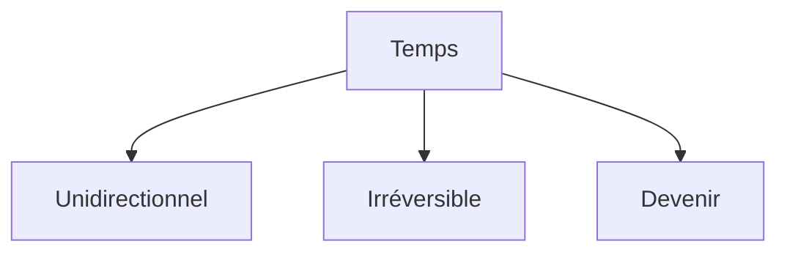

# 1. Le temps est-il linéaire ou circulaire ?
{: .no_toc }

  

    Sommaire
  

  {: .text-delta }
- TOC
{:toc}

## Définition du temps

{: .nouveau-title }
> CARACTÉRISTIQUES DU TEMPS
>
>1. Il est **unidirectionnel**. Il est linéaire et s'écoule dans une seule direction.   
> => **flèche du temps** :  il vient du *futur* ←, il passe par le *présent* ←, il se perd dans le *passé* ←  
>2. Il est **irréversible**. On ne peut pas inverser le court du temps, il n’existe pas de machine à remonter le temps pour revenir dans le passé.
>3. Il est du ***devenir***. À l’opposé de l’***être*** (ce qui ne change pas, ce qui reste identique), il passe, il *devient* chaque fois quelque chose d’autre, il transforme toutes choses (usure, vieillissement).

[→ Ouvrir le schéma détaillé](https://rollauda.github.io/schemas/cartes/temps.html){:target="_blank" }

## L'éternel retour chez Nietzsche

{: .highlight }
Si le temps est linéaire, alors il a un **début**, et il aura un **terme** (la “*fin des temps*”). Or, on peut aussi considérer que le temps est **circulaire** : sans début ni fin, il revient sans cesse sur lui-même. C’est le concept d’**éternel retour**, théorisé par les [**stoïciens**](../L14/L14-1-1.html) et par **Friedrich Nietzsche**.

<iframe width="560" height="315" src="https://www.youtube.com/embed/6OXY1KCObCQ?si=OSxHXnK1j-NsC7rG" title="YouTube video player" frameborder="0" allow="accelerometer; autoplay; clipboard-write; encrypted-media; gyroscope; picture-in-picture; web-share" referrerpolicy="strict-origin-when-cross-origin" allowfullscreen></iframe>

## L'éternel retour dans "Un jour sans fin"

{: .highlight }
> **"*Un jour sans fin*" (Groundhog Day), est un film fantastique réalisé par Harold Ramis et sorti en 1993.**  
>Phil Connors enrage. Comme tous les ans, parce qu'il présente la météo sur une chaîne de télévision de Pittsburgh, il doit se rendre à Punxsutawney pour une fête locale, le "Groundhog Day", qui célèbre tous les 2 février la fin de l'hibernation des marmottes. Un cameraman, Larry, et une belle productrice, Rita, l'accompagnent. Une tempête de neige les empêche de rentrer le soir même. Furieux, Phil se couche tôt. Le lendemain, il semble être le seul à s'apercevoir que la journée de la veille recommence. Mêmes paroles, mêmes incidents. Chaque matin, le 2 février recommence. D'abord dérouté par ce piétinement du temps, Phil y prend bientôt un certain plaisir. Plus rien n'a de conséquence au-delà du délai d'une journée...

<iframe width="560" height="315" src="https://www.youtube.com/embed/iGLbCkCF8_0?si=ztbJglsoXkppZcHI" title="YouTube video player" frameborder="0" allow="accelerometer; autoplay; clipboard-write; encrypted-media; gyroscope; picture-in-picture; web-share" referrerpolicy="strict-origin-when-cross-origin" allowfullscreen></iframe>

