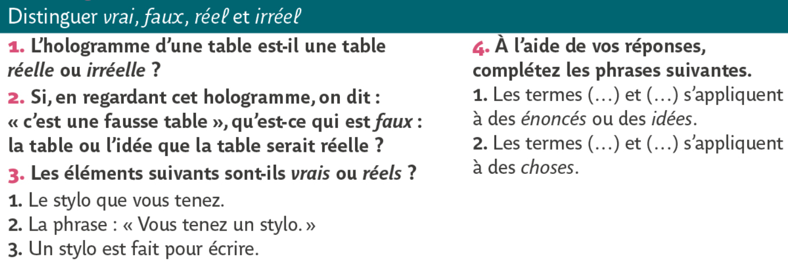
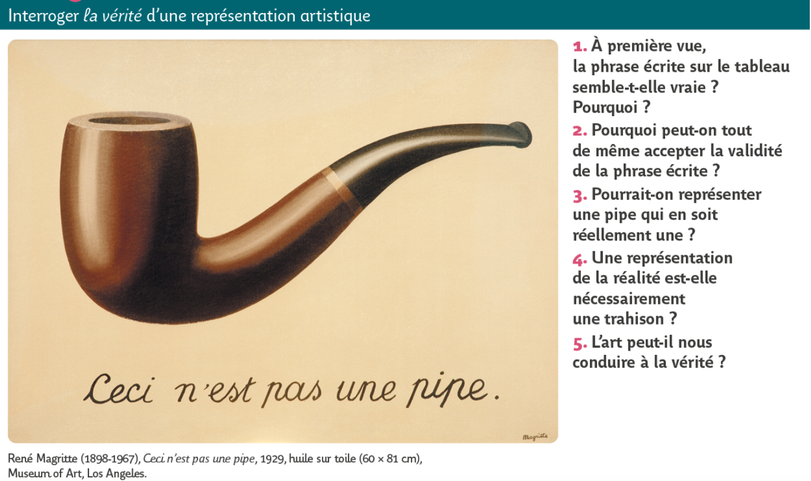
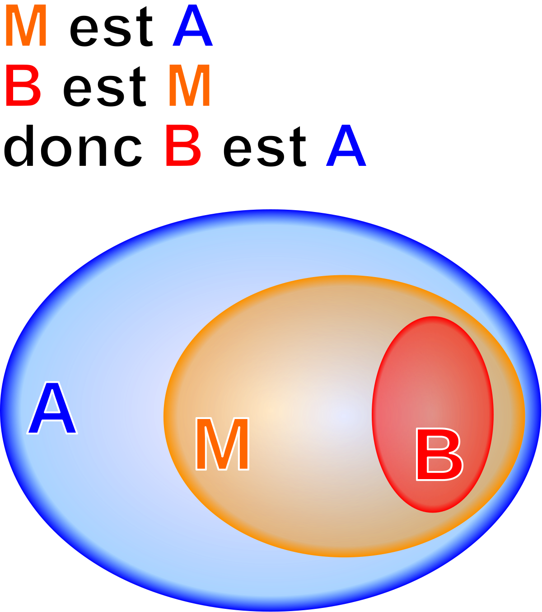

# Introduction : Qu'est-ce que la vérité ?
{: .no_toc }

  

    Sommaire
  

  {: .text-delta }
- TOC
{:toc}

**Le concept de vérité peut être défini de deux manières différentes :** 

## 1. Vérité-adéquation

### Définition de Thomas d'Acquin

> « La vérité est l'adéquation de la chose et de l'esprit » 
>
> Thomas d'Aquin

{: .highlight }
La vérité, en un premier sens, est la correspondance entre ce que nous pensons et ce que nous observons dans le monde. Par exemple, la phrase "*Je suis en classe de Terminale*" est vraie parce que votre affirmation correspond à la réalité. On nomme ce genre de vérité : vérité-adéquation ou vérité de fait.

### Spinoza : différence entre "vrai" et "réel"

| B. Spinoza, *Pensées métaphysiques* (1663)                   |
| ------------------------------------------------------------ |
| La première signification de Vrai et de Faux semble avoir son origine dans les récits ; et l’on a dit vrai un récit, quand le fait raconté était réellement arrivé ; faux, quand le fait raconté n’était arrivé nulle part. Plus tard, les philosophes ont employé le mot pour désigner **l’accord d’une idée avec son objet** ; ainsi, l’on appelle « idée vraie » celle qui montre une chose comme elle est en elle-même ; fausse, celle qui montre une chose autrement qu’elle n’est en réalité. |
| **1. Comment Spinoza définit-il le concept de vérité ?  2. Quelle est la différence entre "vrai" et "réel" ?**|

### Exercice n°1

{: .important-title }
>Manuel Bordas p. 446
>
> 

#### Exemples d'hologrammes

<iframe width="560" height="315" src="https://www.youtube.com/embed/VYEzdx0phWY?si=lsqD0tOn0JhvcEIf" title="YouTube video player" frameborder="0" allow="accelerometer; autoplay; clipboard-write; encrypted-media; gyroscope; picture-in-picture; web-share" allowfullscreen></iframe>

<iframe width="560" height="315" src="https://www.youtube.com/embed/bR_By2jEEcw?si=g1HM0jTDa34Lstwi" title="YouTube video player" frameborder="0" allow="accelerometer; autoplay; clipboard-write; encrypted-media; gyroscope; picture-in-picture; web-share" allowfullscreen></iframe>

### Exercice n°2

{: .important-title }
>Manuel Bordas p. 449
>
>
> 

## 2. Vérité-cohérence 

### Définition de la vérité-cohérence

{: .highlight }
En un second sens, la vérité est la cohérence logique entre les différents éléments d’un raisonnement, d’un discours, d’une assertion. Par exemple, "*2+2 = 4*" et  "*Tout A est B ; or C est A. Donc C est B*" sont des affirmations vraies, car elles respectent les règles de la logique et n’impliquent aucune contradiction. De même, "*Bilbo est un Hobbit*" est une affirmation vraie car elle est cohérente (dans le monde d'héroïc-fantasy de Tolkien), même si elle est en même temps fausse, car ne correspond pas à quelque chose de réel (vérité-adéquaton).   
**On nomme ce genre de vérité : vérité-cohérence ou vérité de raison.**

### Exemples de vérité-cohérence dans les syllogismes

{: .nouveau-title }
> Qu'est-ce qu'un syllogisme ?
>
> - La **logique** est une discipline enseignée d'abord par Aristote qui décrit les lois fondamentales de l'esprit. Elle formalise les raisonements à l'aide de symboles (*A, B, x, y*, etc.). La logique permet de savoir si un raisonnement est valide (cohérent) ou invalide (incohérent).
> 
> - Un **syllogisme** est un modèle de raisonnement logique inventé par Aristote. Il s'agit d'un **raisonnement déductif**, qui part d'une affirmation générale pour aboutir à une vérité particulière. 
>
> - Le syllogisme relie trois propositions : une **majeure**, une **mineure** (appelées prémisses) et une **conclusion**. Sa forme type est « **Tout A est B, or C est A donc C est B** », A étant le moyen terme qui sert d’intermédiaire entre B et C (n'importe quel symbole peut convenir).  
>
>>>>> 
>
> L'exemple célèbre utilisé par Aristote est le suivant : 
>
>> [majeure] **Tous les hommes** (H) **sont mortels** (M)  
>> [mineure] **Or Socrate** (S) **est un homme** (H)  
>> [conclusion] **Donc Socrate** (S) **est mortel** (M).  
>
>>> → **<u>Exercice : représentez le syllogisme précédent sous forme de groupes (cercles)</u>**
>
> **Ce syllogisme est vrai en deux sens :**
>> - C'est une vérité de fait (vérité-adéquation), car Socrate est bien un être mortel (en logique, on parle de **vérité matérielle**)
>> - C'est une vérité-cohérence (en logique, on parle de **vérité formelle**), car le syllogisme est cohérent, valide sur la forme.

{: .important-title }
> DES VÉRITÉS NON-DÉMONTRÉE : VRAIES SUR LE FOND, MAIS INCOHÉRENTES, FAUSSES DANS LEUR RAISONNEMENT
>
> **Une affirmation peut être vraie sur le fond (vérité-adéquation, vérité matérielle) et fausse sur la forme (vérité-cohérence, ou vérité formelle). Cela signifie que la vérité n'a pas pu être démontrée. Nous avons une vérité matérielle, mais pas une vérité formelle.**  
>**EXEMPLE :**
>
>> Tous les hommes sont mortels (A = B)  
>> Or, Sorcate est mortel (C = B)  
>> Donc Socrate est un homme (C = A)
>>
>>> → **<u>Exercice : représentez ce syllogisme invalide sous formes de groupes (cercles) pour comprendre.</u>**

{: .highlight-title }
> DES DÉMONSTRATIONS COHÉRENTES MAIS FAUSSES SUR LE FOND, VRAIES FORMELLEMENT MAIS FAUSSES MATÉRIELLEMENT</u>
>
> **Une affirmation peut être fausse sur le fond (vérité-adéquation ou vérité matérielle) et vraie sur la forme (vérité-cohérence, ou vérité formelle). <u>EXEMPLE:</u>**
>
>> Tous les chats ont dix pattes (A = B)  
>> Or, Mistigri est un chat (C = A)  
>> Donc Mistigri a dix pattes. (C = B)  
>
>> Les Hobbits sont peureux (A = B)  
>> Or, Bilbo est un Hobbit (C = A)  
>> Donc, Bilbo est peureux. (C = B)

{: .note-title }
> Faire des exercices de syllogistique
>
> [→ Exercices](../../docs/L3/L3-0-2-2.html)

## Synthèse

{: .important-title }
>Exercice : 
>
> Faire un tableau à deux colonnes. Dans chaque colonne, introduisez un type de vérité avec ses différentes dénominations. En-dessous, donnez des exemples de chaque type de vérité puis leur définition.

|            | Vérité... | Vérité... |
| ---------- | --------- | --------- |
| Exemples   |           |           |
| Définition |           |           |

