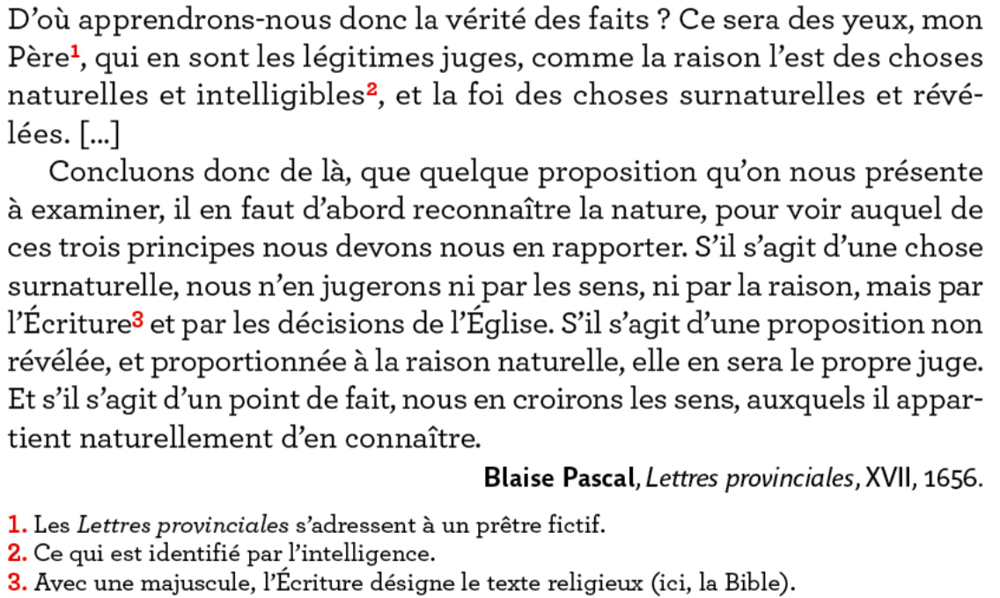
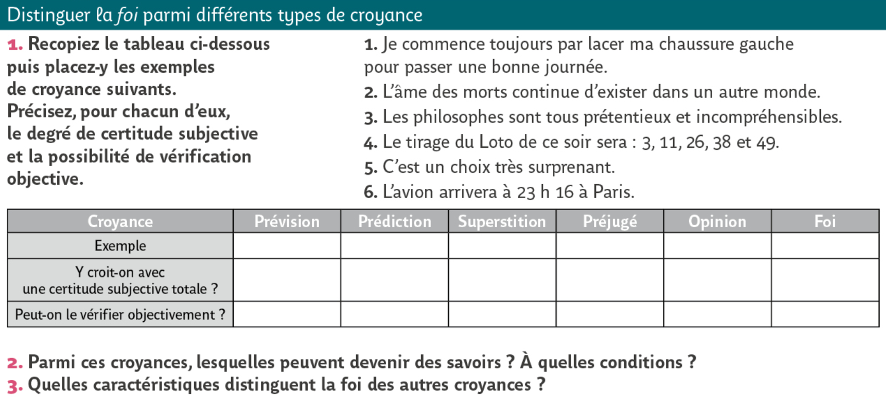

# Introduction 1 : <br> Qu'est-ce que croire ?
{: .no_toc }

<details open markdown="block">
  <summary>
    Sommaire
  </summary>
  {: .text-delta }
- TOC
{:toc}
</details>


```
Notions complémentaires : Raison, Vérité.
```

## "Savoir", "croire que", "croire en"

**<u>Repère conceptuels</u>**

| Croire et Savoir | Foi et Raison   |
| ------------------------ | ------------------------------ |
| **<u>Croire</u>** : Attitude de l'esprit qui adhère à une idée sans que celle-ci soit démontrée ou prouvée.<br />**<u>Savoir</u>** : Attitude de l'esprit qui accepte une vérité après l'avoir confirmée par démonstration ou expérimentation. | La foi (du latin *fides* : loyauté, fidélité, respect de la parole donnée) est une forme de confiance absolue en une vérité : il peut s'agir de la foi en l'homme (croire en la bonté humaine), de la foi en soi-même, ou encore en l'existence de Dieu. <br />La foi est plus forte que la simple croyance, car elle a le caractère de la certitude, mais une certitude subjective, seulement pour celui qui croit. <br />**On oppose la foi à la raison**, parce que la raison implique des certitudes objectives, que tout le monde peut partager. |

{: .note-title }
> Exercice n°1. 
> 
> Précisez, pour chacune de ces propositions, s'il s'agit d'une croyance ou d'un savoir, et expliquez pourquoi.
>> - Je crois en toi
>> - Dieu existe
>> - La terre est plate
>> - Les élèves sont plus jeunes que les professeurs
>> - On dirait qu'il va pleuvoir
>> - La terre tourne autour du soleil


{: .highlight-title }
> Exercice n°2
>
> 1. Reproduire et remplir le tableau suivant en utilisant les propositions de l'exercice précédent.
> 2. Synthétiser le tableau en expliquant ce qui distingue le savoir, la croyance "que" et la croyance "en".
> 
> |                                                | "Je crois que..." | "Je crois en..." | "Je sais que..." |
> | ---------------------------------------------- | ----------------- | ---------------- | ---------------- |
> | Trouver des <br />synonymes <br />et illustrer |                   |                  |                  |
> | Définir                                        |                   |                  |                  |
>  
> | Synthèse    |  ....................................................................................................  |

## Quel type de savoir est la foi religieuse ? 

**<u>Exercice n°3</u>**



{: .nouveau-title }
> Questions sur le texte
>
> **<u>Question 1</u>**. À l'aide du texte de Blaise Pascal, reproduire sur votre cahier et remplir le tableau suivant en y introduisant les outils de connaissance dont dispose l'être humain et les objets qui leur correspondent. Utilisez les formules : *Choses révélées / acceptée comme telle / L'écriture / Raison / Faits / Choses intelligibles / Sens*.
>
>| Type de vérité     | Outils de connaissance | Types d'obets à connaitre |
>| ------------------ | ---------------------- | ------------------------- |
>| Vérité de faits    |                        |                           |
>| Vérité rationnelle |                        |                           |
>| Vérité révélée     |                        |                           |
>
>**<u>Question 2</u>.** Complétez le texte à trou, en le recopiant sur votre cahier, avec les formules suivantes : *à la foi / Dieu / acceptée comme telle / aux sens / à un prophète / à la raison*
>
>> Une vérité révélée est celle qui n'est pas accessible ____________ comme les vérités de fait, ou ____________ comme les vérités rationnelles, mais seulement  ____________ . Elle a été directement révélée par ____________ , souvent  ____________ . Elle réclame d'être ____________. 

## En quoi la foi religieuse se distingue-t-elle d'autres types de croyances ? 

**<u>Exercice n°4</u>**

