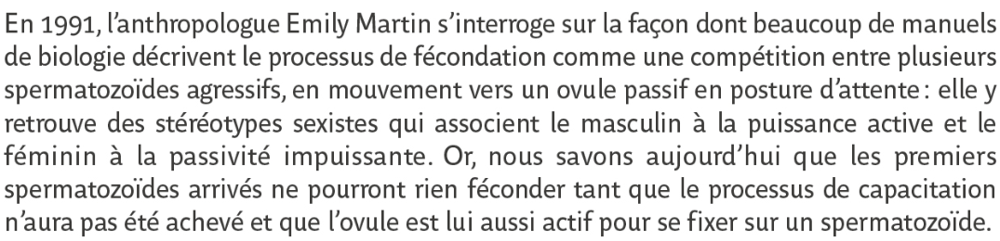

# 1. La science pense contre l'opinion
{: .no_toc }

  

    Sommaire
  

  {: .text-delta }
- TOC
{:toc}

## Exercice introductif

{: .highlight }
> 1. Qu'est-ce qu'une opinion ?   
> 2. L'opinion est-elle une connaissance ?  
>  
> *→ Partir du verbe "opiner" et d'exemples d'opinions pour répondre aux deux questions*

## L'opinion, un obstacle à la science

| Gaston Bachelard, *La formation de l’esprit scientifique* (1938) |
| ------------------------------------------------------------ |
| La science, dans son besoin d'achèvement comme dans son principe, s'oppose absolument à l'opinion. (...) L'opinion a, en droit, toujours tort. L'opinion pense mal, elle ne pense pas, elle traduit des besoins, en  connaissances. En désignant les objets par leur utilité, elle s'interdit de les connaître. On ne peut rien fonder sur l'opinion : il faut  d'abord la détruire. Elle est le premier obstacle à surmonter. |
| Un seul  exemple : l'équilibre des corps flottants fait l'objet d'une intuition familière qui est un tissu d'erreurs. D'une manière plus ou moins nette, on attribue une activité au corps qui flotte, mieux au corps qui nage.  Si l'on essaie avec la main d'enfoncer un morceau de bois dans l'eau, il résiste. On n'attribue pas facilement la résistance à l'eau. Il est dès lors assez difficile de faire comprendre le principe d'Archimède dans  son étonnante simplicité mathématique si l'on n'a pas d'abord critiqué  et désorganisé le complexe impur des intuitions premières. En  particulier sans cette psychanalyse des erreurs initiales, on ne fera  jamais comprendre que le corps qui émerge et le corps complètement  immergé obéissent à la même loi. |
| *1. (Premier texte) Expliquez ce qui oppose science et opinion. Cherchez un exemple pour illustrer cette opposition. *|
| *2. (Second texte) Quelle opinion ("intuition familière") se fait-on sur les corps qui flottent ? Que nous dit la science à ce propos ?* |

## Exercice complémentaire

{: .nouveau-title }
> Manuel Bordas p. 343
>
>En quoi cet exemple tiré de manuels de biologie illustre-t-il la thèse de Bachelard selon laquelle "*La science s'oppose absolument à l'opinion* (...). *L'opinion a (...) toujours tort"* ?
>
>  

