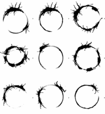

# Film "Premier Contact"
{: .no_toc }

  

    Sommaire
  

  {: .text-delta }
- TOC
{:toc}

## Présentation

**Illustration de la question de Lévi-Strauss :** 

> (...) *imaginez que nous tombions sur des êtres vivants qui possèdent un langage, aussi différent du nôtre qu’on voudra, mais qui serait traduisible dans notre langage, donc des êtres avec lesquels nous pourrions communiquer*...

---

| **"Premier Contact" (*Arrival*, 2016) est un film de Denis Villeneuve.**     **SYNOPSIS** : Lorsque de mystérieux vaisseaux venus du fond de l'espace surgissent un peu partout sur Terre, une équipe d'experts est rassemblée sous la direction de la linguiste Louise Banks afin de tenter de comprendre leurs intentions. |  |  

## Trailer

<iframe width="560" height="315" src="https://www.youtube.com/embed/WVZHixIBxAc?si=iHd_inMTLhpfQU9N" title="YouTube video player" frameborder="0" allow="accelerometer; autoplay; clipboard-write; encrypted-media; gyroscope; picture-in-picture; web-share" allowfullscreen></iframe>

## Extrait

<iframe width="560" height="315" src="https://www.youtube.com/embed/LwPpwLy4UIU?si=glVWVul7z7rmPmGU" title="YouTube video player" frameborder="0" allow="accelerometer; autoplay; clipboard-write; encrypted-media; gyroscope; picture-in-picture; web-share" allowfullscreen></iframe>