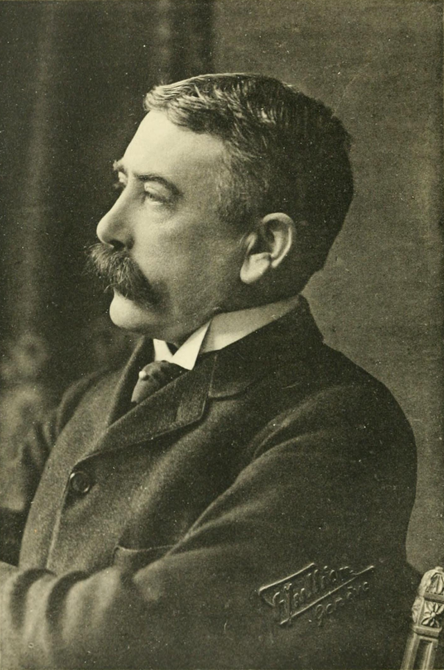
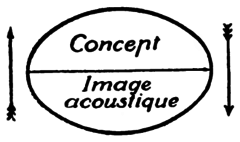
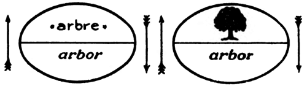

# 1. Qu'est-ce que parler ?
{: .no_toc }

  

    Sommaire
  

  {: .text-delta }
- TOC
{:toc}

## 1.1. Les pouvoirs de la parole

- extrait 1984 + recopier questions
- chercher liste de néologismes comme guerre / conflit, mort / disparition

### 1984 

{: .highlight }
> 1984 est le plus célèbre roman de George Orwell, publié en 1949. Il décrit une Grande-Bretagne trente ans après une guerre nucléaire entre l'Est et l'Ouest censée avoir eu lieu dans les années 1950 et où s'est instauré un régime totalitaire fortement inspiré à la fois de certains éléments du stalinisme et du nazisme.

{: .important-title }
> QUESTIONS
>
> 1. S'agit-il dans cette fiction d'un contrôle du langage ou d'un contrôle de la pensée ?
> 2. Ces phénomènes existent-ils ou ont-il existé dans le monde réel ? Donnez des exemples.
> 3. Faut-il se méfier du pouvoir du langage ?

### Extrait

<iframe width="560" height="315" src="https://www.youtube.com/embed/rrgZt7-8ru4?si=Pkj0axcFLoVJHWUR" title="YouTube video player" frameborder="0" allow="accelerometer; autoplay; clipboard-write; encrypted-media; gyroscope; picture-in-picture; web-share" referrerpolicy="strict-origin-when-cross-origin" allowfullscreen></iframe>

### Vidéo complémentaire (Mr PHI)

<iframe width="560" height="315" src="https://www.youtube.com/embed/EvUZ5eToi10?si=0nYJAtY9LU-ikwMD" title="YouTube video player" frameborder="0" allow="accelerometer; autoplay; clipboard-write; encrypted-media; gyroscope; picture-in-picture; web-share" referrerpolicy="strict-origin-when-cross-origin" allowfullscreen></iframe>

## 1.2. Les bénéfices de la parole sur l’espèce humaine

| Isocrate, *Sur l’échange*         |
| ------------ |
| La parole (…) est à l'origine des biens les plus grands. En effet, de tous nos autres caractères aucun ne nous distingue des animaux. Nous sommes même inférieurs à beaucoup sous le rapport de la rapidité, de la force, des autres facilités d'action. Mais, parce que nous avons reçu le pouvoir de nous convaincre mutuellement et de faire apparaître à nous-mêmes l'objet de nos décisions, non seulement nous nous sommes débarrassés de la vie sauvage, mais nous nous sommes réunis pour construire des villes ; nous avons fixé des lois ; nous avons découvert des arts et, presque toutes nos inventions, c'est la parole qui nous a permis de les conduire à bonne fin. C'est la parole qui a fixé les limites légales entre la justice et l'injustice, entre le mal et le bien ; si cette séparation n'avait pas été établie, nous serions incapables d'habiter les uns près des autres. |
| *1. Surlignez le passage du texte qui définit la parole et expliquez-le.*  *2. Quels sont les effets de la parole sur l'humanité ?*  

## 1.3. Langage et langue, voix et parole

| Qui était Ferdinand de Saussure ?          |
| ------------------------------ |
|  |
| Ferdinand de Saussure (1857 - 1913), est un linguiste suisse. Il est considéré comme le père de la linguistique moderne grâce à son "*Cours de linguistique générale*", publié à titre posthume par ses élèves en 1916. Cette publication a marqué un tournant dans l'étude du langage, introduisant des concepts fondamentaux tels que la distinction entre langue, langage et parole, la distinction entre signifiant et signifié, et l'idée du caractère arbitraire et conventionnel du signe linguistique. |

| Ferdinand de Saussure, *Cours de linguistique générale* (1916)     |
| ------------------- |
| Mais qu'est-ce que la langue ? Pour nous elle ne se confond pas avec le langage  ; elle n'en est qu'une partie déterminée, essentielle, il est vrai. C'est à la fois un produit social de la faculté du langage et un ensemble de conventions nécessaires, adoptées par le corps social pour permettre l'exercice de cette faculté chez les individus. (...) L'exercice du langage repose sur une faculté que nous tenons de la nature, tandis que la langue est une chose acquise et conventionnelle. (...) On pourrait dire que ce n'est pas le langage parlé qui est naturel à l'homme, mais la faculté de constituer une langue, c'est-à-dire un système de signes distincts correspondant à des idées distinctes. |
| *Quelle distinction établit F. de Saussure entre langue et langage ?*      |

## 1.4. Signifiant et signifié

| Ferdinand de Saussure, *Cours de linguistique générale* (1916)     |
| -------------------- |
| (1) Le signe linguistique unit non une chose et un nom, mais un concept et une image acoustique. Cette dernière n'est pas le son matériel, chose purement physique, mais l'empreinte psychique de ce son, la représentation que nous en donne le témoignage de nos sens ; elle est sensorielle, et s'il nous arrive de l'appeler « matérielle », c'est seulement dans ce sens et par opposition à l'autre terme de l'association, le concept, généralement plus abstrait. Le signe linguistique est donc une entité psychique à deux faces, qui peut être représentée par la figure  : |
|     |
| Cette définition pose une importante question de terminologie. Nous appelons **_signe_** la combinaison du concept et de l'image acoustique. (...) (2) Le lien unissant le signifiant au signifié est arbitraire, ou encore, nous pouvons dire plus simplement : _le signe linguistique est arbitraire_. (...) Ainsi l'idée de « _soeur_ » n'est liée par aucun rapport intérieur avec la suite de sons **_s—ö—r_** qui lui sert de signifiant ; il pourrait être aussi bien représenté par n'importe quelle autre : à preuve les différences entre les langues et l'existence même de langues différentes : le signifié « _boeuf_ » a pour signifiant **_b—ö—f_** d'un côté de la frontière, et **_o—k—s_** (_Ochs_) de l'autre. |
| *1. Les mots que nous utilisons sont des « signes ». Quelles sont les deux faces d’un signe ? Utilisez un autre exemple de « arbre » pour l’expliquer.   2. Expliquez ce que veut dire de Saussure lorsqu'il affirme que *« le signe linguistique est arbitraire »*.*     |

## 1.5. De l’arbitraire du signe au relativisme linguistique

>  « *Les limites de mon langage signifient les limites de mon monde.* »  
>  Ludwig Wittgenstein, “Tractatus Logico-Philosophicus” (1921)

{: .note-title }
> L'hypothèse Sapir-Whorf
>
> Cette hypothèse, également connue sous le nom de « Principe de relativité linguistique », est une théorie formulée dans les années 1950 par deux linguistes américains (Edward Sapir et son élève Benjamin Lee Whorf). Elle affirme que la structure d'une langue influence la manière dont les êtres humains perçoivent et pensent le monde. Selon cette hypothèse, les catégories linguistiques et grammaticales d'une langue façonnent la réalité perçue et la pensées de ses utilisateurs. Ainsi, il n’y aurait pas « un » monde partagé par tous les hommes. La réalité et la pensée de chaque être humain serait « filtrées » par la langue. Cette hypothèse aurait pour conséquence que les catégories fondamentales de l’expérience humaine – comme l’espace et le temps – varieraient plus ou moins d’une langue et d’une culture à l’autre. 

{: .highlight-title }
> Un exemple : la langue Hopi et la perception du temps
>
> Benjamin Lee Whorf a étudié la langue Hopi, une langue amérindienne. Il a observé que cette langue ne comporte aucune marque grammaticale du temps, telle que le passé, le présent, et le futur, comme c'est le cas dans les langues indo-européennes. Cette caractéristique de la langue Hopi reflèterait une conception différente du temps, non linéaire et moins segmentée que dans les cultures occidentales. Cette observation a été utilisée pour illustrer comment la structure linguistique peut influencer la perception de concepts abstraits comme le temps, qui est étroitement lié à l'espace dans de nombreuses langues.

| Benjamin Lee Whorf, *Langage* (1929)    |
| ----------------------- |
| Les êtres humains ne vivent pas uniquement dans le monde objectif ni dans le monde des activités sociales tel qu’on se le représente habituellement, mais ils sont en grande partie conditionnés par la langue particulière qui est devenue le moyen d’expression de leur société. Il est tout à fait erroné de croire qu’on s’adapte à la réalité pratiquement sans l’intermédiaire de la langue, et que celle-ci n’est qu’un moyen accessoire pour résoudre des problèmes spécifiques de communication ou de réflexion. La vérité est que le « monde réel » est dans une large mesure édifiée inconsciemment sur les habitudes de langage du groupe. |
| *1. A l’aide de la présentation de l'hypothèse Sapir-Whorf et du texte ci-dessus, formulez deux thèses à propos du lien entre langage et réalité : celle de Whorf, et son anti-thèse.  2. Cherchez des exemples dans des langues différentes que vous connaissez de mots ou expressions qui illustrent l'hypothèse Sapir-Whorf.*           |