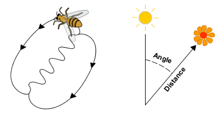

# 2. Que disent les animaux non humains ?
{: .no_toc }

<details open markdown="block">
  <summary>
    Sommaire
  </summary>
  {: .text-delta }
- TOC
{:toc}
</details>

## 2.1. La danse des abeilles

| Émile Benveniste, *Problèmes de linguistique générale* (1966)                     |   
| --------------------------------- | 
|   |  
| Karl von Frisch (...) a observé, dans une ruche transparente, le comportement de l’abeille qui rentre après une découverte de butin. Elle est aussitôt entourée par ses compagnes au milieu d’une grande effervescence, et celles-ci tendent vers elles leurs antennes pour recueillir le pollen dont elle est chargée, ou elles absorbent le nectar qu’elle dégorge. Puis, suivie par ses compagnes, elle exécute des danses. (...). L’abeille se livre, selon le cas, à deux danses différentes. L’une consiste à tracer des cercles horizontaux de droite à gauche, puis de gauche à droite successivement. L’autre, accompagnée d’un frétillement continu de l’abdomen (wagging dance), imite à peu près la figure d’un 8 : l’abeille court droit, puis décrit un tour complet vers la gauche, de nouveau court droit, recommence un tour complet sur la droite, et ainsi de suite. (...) | 
| La danse en cercle annonce que l’emplacement de la nourriture doit être cherché à une faible distance, dans un rayon de cent mètres environ autour de la ruche. Les abeilles sortent alors et se répandent autour de la ruche jusqu’à ce qu’elles l’aient trouvé. L’autre danse (...) indique que le point est situé à une distance supérieure, au-delà de cent mètres et jusqu’à six kilomètres. Ce message comporte deux indications distinctes, l’une sur la distance propre, l’autre sur la direction. La distance est impliquée par le nombre de figures dessinées en un temps déterminé (...). Plus la distance est grande, plus la danse est lente. Quant à la direction où le butin doit être cherché, c’est l’axe du « huit » qui la signale par rapport au soleil ; selon qu’il incline à droite ou à gauche, cet axe indique l’angle que le lieu de la découverte forme avec le soleil.<br>(...) Nous sommes pour la première fois en mesure de spécifier avec quelque précision le mode de communication employé dans une colonie d’insectes ; et pour la première fois nous pouvons nous représenter le fonctionnement d’un « langage » animal. |  ...  |
| *1. Décrivez la danse des abeilles et leur fonction. Aidez-vous des vidéos projetées en classe et du schéma. <br>2. En quel sens peut-on parler, pour cette danse, de langage ?*     |

| Émile Benveniste, *Problèmes de linguistique générale* (1966)    |
| ----------------------- |
| Il peut être utile de marquer brièvement en quoi il est ou il n’est pas un langage, et comment ces observations sur les abeilles aident à définir, par ressemblance ou par contraste, le langage humain.<br>(...) Mais les différences sont considérables et elles aident à prendre conscience de ce qui caractérise en propre le langage humain. Celle-ci, d’abord essentielle, que le message des abeilles consiste entièrement dans la danse, sans intervention d’un appareil « vocal », alors qu’il n’y a pas de langage sans voix. D’où, une autre différence, qui est d’ordre physique. N’étant pas vocale mais gestuelle, la communication chez les abeilles s’effectue nécessairement dans des conditions qui permettent une perception visuelle, sous l’éclairage de jour ; elle ne peut avoir lieu dans l’obscurité. Le langage humain ne connaît pas cette limitation.<br>Une différence capitale apparaît aussi dans la situation où la communication a lieu. Le message des abeilles n’appelle aucune réponse de l’entourage, sinon une certaine conduite, qui n’est pas une réponse. Cela signifie que les abeilles ne connaissent pas le dialogue, qui est la condition du langage humain. |
| *Émile Benveniste ne considère pas que la communication des abeilles est un vrai langage. Quelles sont les trois différences essentielles entre la communication des abeilles et le langage humain ?*    |

### 2.2. Koko, la gorille qui connaissait la langue des signes

**Koko** (4 juillet 1971, San Francisco, Californie - 19 juin 2018) était une femelle gorille vivant en captivité connue pour être capable de communiquer en langue des signes. Elle a été éduquée par l'éthologue **Penny Patterson**. Selon celle-ci, Koko maîtrisait plus de 1 000 signes différents, dont 500 couramment, issus de la langue des signes américaine.

Son acculturation (processus de réciprocité et d'échanges entre cultures en contact) semble lui avoir conféré des comportements inconnus chez les gorilles. Ainsi elle aimait garder des animaux de compagnie, a passé avec succès le test du miroir. Koko avait la capacité d'inventer de nouveaux signes, une perception de l'écoulement du temps semblable à l'homme et la conscience de la mort (elle a exprimé sa tristesse lors de la mort de l'acteur Robin Williams qu'elle avait rencontré après l'avoir vu dans des films).

(Wikipedia)
### 2.3. Langage et communication

```
EXERCICE.
Après avoir étudié le schéma suivant, et à l’aide des exemples de Koko et des abeilles,  répondez à la question : « Les animaux non-humains sont-ils dotés de langage, ou se contentent-ils de communiquer ? »
```

schema-langage