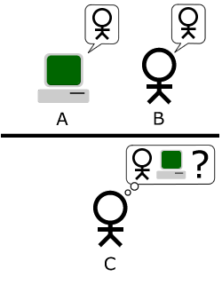

# Complément : Une machine qui parle pense-t-elle ?
{: .no_toc }

  

    Sommaire
  

  {: .text-delta }
- TOC
{:toc}

## Le test de Turing (article de Philosophie Magazine)

{: .highlight }
NOTIONS : Langage, Raison, Technique

|  | À la question épineuse : « *Les machines peuvent-elles penser ?* », Turing a proposé une réponse habile et indirecte, en fixant les règles de ce qu’il appelle le « jeu de l’imitation ». En résumé, une personne [C] communique à l’aveugle par messages écrits interposés avec deux partenaires [A et B], dont l’un est un humain [B] et l’autre un ordinateur [C] qui essaie de se faire passer pour un humain. Le test est considéré réussi si le juge n’arrive pas à déterminer qui est l’humain et qui est la machine. En 1950, Turing a prédit : « *dans cinquante ans* », il sera possible de programmer un ordinateur « *de telle façon qu’un interrogateur moyen n’aura pas plus de 70 % de chances de procéder à la bonne identification après cinq minutes de conversation* ». Pour concevoir son test, Turing s’est inspiré de Descartes, qui écrit dans la cinquième partie du Discours de la méthode (1637) : « *On peut bien concevoir qu’une machine soit tellement faite qu’elle profère des paroles* (...)*, mais non pas qu’elle les arrange diversement, pour répondre au sens de tout ce qui se dira en sa présence, ainsi que les hommes les plus hébétés peuvent le faire.* »     *1. Expliquez en quoi consiste le test de Turing   2. Que prédit Turing ?   3. Que signifie la citation de René Descartes, et Turing est-il d’accord avec la thèse du philosophe français ?*         |

## Tester : Machine, ou pas ?

**Le dialogue suivant est la retranscription d'un véritable test de Turing. Essayez de deviner si "l'entité" est un être humain ou une machine.**

| **Examinateur**   Aimez-vous le printemps ?   **Entité**   Ca dépend de mon humeur.   **Examinateur**   Combien font 11 et 11 ?   **Entité**   22   **Examinateur**   Et 512+512?   **Entité**   Je n'ai jamais été doué en calcul mental.   **Examinateur**   Ce n'est pas grave, essayez.   **Entité**   Voyons, 1000 quelque chose. 1024 je pense.   **Examinateur**   Récitez-moi un poème.   **Entité**   La servante au grand coeur dont vous étiez jalouse. Et qui dort son sommeil sous une humble pelouse...   **Examinateur**   Pourquoi ne remplacez-vous pas "au grand coeur" par "au grand air" ? A mon avis ce serait plus joli.  | **Entité**   Je l'aime mieux tel quel.   **Examinateur**   Pourquoi?   **Entité**   Vous n'êtes pas sérieux. "Au grand air" et "au grand coeur" ce n'est pas pareil.   **Examinateur**   Alors remplacez "Et qui dort son sommeil" par "qui tristement sommeille".   **Entité**   Vraiment, je l'aime mieux tel quel.   **Examinateur**   Pourquoi ?   **Entité**   Le rythme du poème est meilleur.   **Examinateur**   Ce n'est pas mon avis   **Entité**   Vous aimez Baudelaire?   **Examinateur**   Oui | **Entité**   Moi aussi.   **Examinateur**   Pourquoi   **Entité**   Je trouve qu'il exprime des sentiments profonds qui correspondent souvent à ce que je peux éprouver. Et puis peut-être aussi que ça me rappelle la période où je l'ai lu pour la première fois quand j'étais ado.   **Examinateur**   Vous aimez l'art?   **Entité**   Oui   **Examinateur**   Vous peignez ?   **Entité**   Comme un pied. Je suis plus attiré par la musique.   **Examinateur**   Vous jouez d'un instrument?   **Entité**   Oui, du piano**   Examinateur**   Jouez-nous un morceau.   **Entité**   Je n'ai pas d'instrument. |

## Discuter

| Vincent Descombes, *La Denrée mentale* (1995)             |
| ------------------------ |
| On peut donc dire qu'une machine bien programmée pourrait (peut-être) réussir à simuler un intérêt pour les sujets dont j'ai envie de parler dans la conversation. Mais cette simulation resterait une mystification décevante si la machine ne devait pas, pour s'intéresser à ce qui m'occupe, partager mes intérêts. Je veux dire que le seul partenaire avec lequel on puisse désirer se livrer à cet exercice d'une conversation, c'est celui qui est en mesure de reconnaître (...) mes sujets de conversations comme étant aussi les siens. |
| *Même si la machine est capable de converser avec un humain, qu’est-ce qui continue de nous distinguer d’elle, selon Vincent Descombes ?*     |

## Blade Runner

| **Blade Runner est un film de science-fiction américain réalisé par Ridley Scott et sorti en 1982. Son scénario s'inspire du roman "Les androïdes rêvent-ils de moutons électriques ?" de l'auteur Philip K. Dick.** Dans les dernières années du 20ème siècle, des milliers d'hommes et de femmes partent à la conquête de l'espace, fuyant les mégalopoles devenues insalubres. Sur les colonies, une nouvelle race d'esclaves voit le jour: les Répliquants, des androïdes que rien ne peut distinguer de l'être humain et conçus par la Tyrell Corporation. Mais, suite à une révolte, ces derniers sont peu à peu retirés du marché. Quatre d'entre eux parviennent cependant à s'échapper et à s'introduire dans Los Angeles. Un agent spécial, un "blade-runner", Rick Deckard, est chargé de les exterminer... |   |

{: .note-title }
> PREMIER EXTRAIT
>
> 
> Pour distinguer un Réplicant d'un humain, il faut faire passer au sujet le test de Voight-Kampff. Au début du film, un blade runner teste Leon Kowalski, un nouvel employé de la Tyrell Corporation. 
>
> <iframe src="https://drive.google.com/file/d/14qorvgH5Pm42MP6JD2T3UoFWCFYh5Gfw/preview" width="640" height="400" allow="autoplay"></iframe>
>
> 1. **Dans ce premier extrait, qu'est ce qui permet de distinguer un androïde d'un être humain ?**

{: .nouveau-title }
> SECOND EXTRAIT
> 
> Deckard se rend à la Tyrell Corporation pour y rencontrer Eldon Tyrell, le créateur des réplicants. Tyrell lui demande de faire passer le test de Voight-Kampff à Rachel, son assistante. 
>
> <iframe src="https://drive.google.com/file/d/14ojn5PA35QwOoI8nHhl7Gt_AXihQmna1/preview" width="640" height="400" allow="autoplay"></iframe>
>
> 2. **Dans ce second extrait, qu'est ce qui permet de distinguer un androïde d'un être humain ?**

{: .highlight-title }
> C**omparez le test de Voight-Kampff du film "Blade Runner" et le test de Turing.**   
> - Qu'ont-il de simillaire ?   
> - Quest-ce qui les distingue ?  

## Supplément : Alan Turing, "*Les ordinateurs et l'intelligence*"

<iframe src="https://drive.google.com/file/d/1pB6iiHBqaCBAdGeZdYi5AxdwCFuW6FoW/preview" width="640" height="400" allow="autoplay"></iframe>