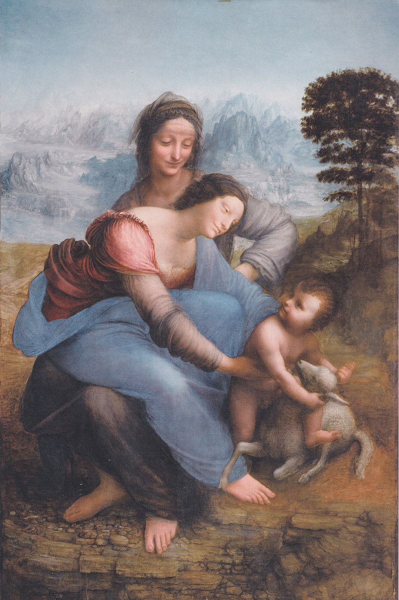
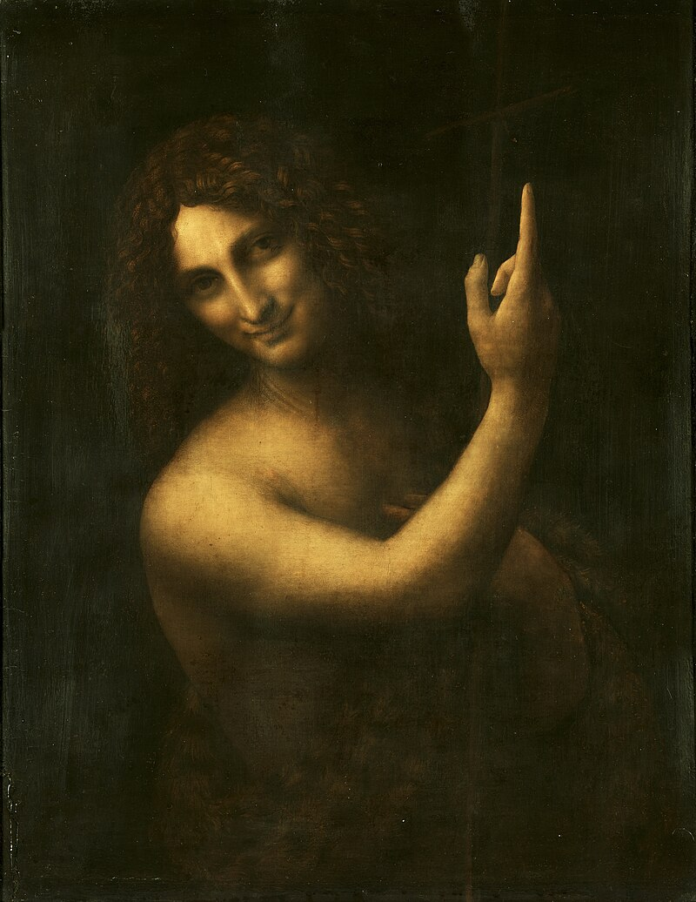
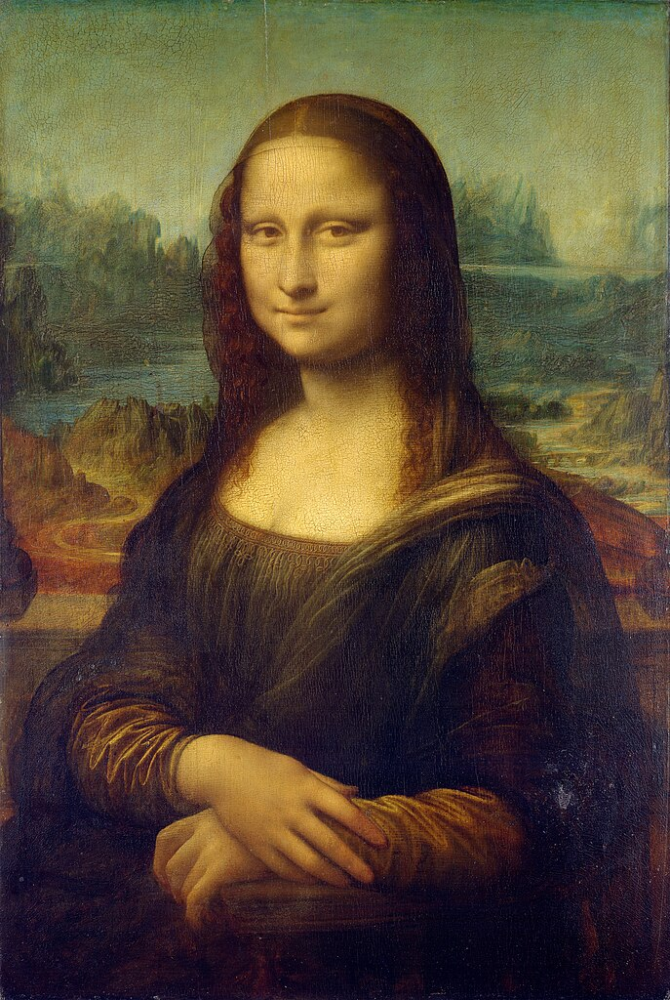

## Da Vinci : le *Sfumato*

{: .highlight }
>Le *sfumato* est une technique picturale apparue à la Renaissance, qui donne au sujet des contours imprécis et flous. Pour parvenir à cet effet, les peintres superposent sur les visages et las mains de leurs personnages de fines couches de peinture.  
> Léonard de Vinci a théorisé l'usage du sfumato, lié à ses recherches sur la vision et l'optique, ainsi que ses expérimentations avec la camera obscura (ancêtre de l’appareil photographique). « *Veille à ce que tes ombres et lumières se fondent sans traits ni lignes, comme une fumée* », écrivait-il. On retrouve cette technique dans ses tableaux *Saint-Anne* ou *La Joconde*.  
L'analyse de ce tableau par des scientifiques a conclu, en 2010, que le tableau est recouvert de dizaines de couches de 1 à 3 microns d’épaisseur.   
> 
<iframe width="560" height="315" src="https://www.youtube.com/embed/KZWuQBzYkRs?si=yxTz6ml3TQ33s3zb" title="YouTube video player" frameborder="0" allow="accelerometer; autoplay; clipboard-write; encrypted-media; gyroscope; picture-in-picture; web-share" referrerpolicy="strict-origin-when-cross-origin" allowfullscreen></iframe>

{: .important-title }
>EXERCICE
>
> Voir les tableaux suivants de Léonard de Vinci.     
>**En quoi la technique du sfumato illustre-t-elle la conception kantienne du génie ?**

| **Sainte Anne** | **Saint Jean-Baptiste** | **Mona Lisa** |
|-------|-------|-------|
|      |     |      |

