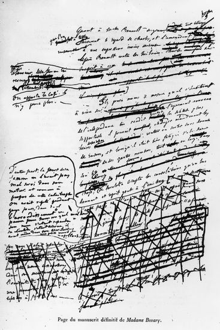
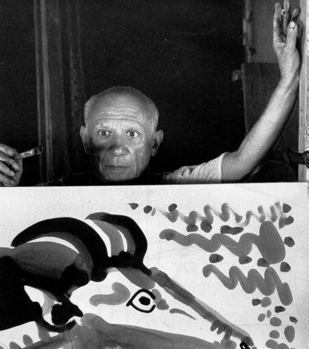

## Génie ou travail ?
{: .no_toc }

  

    Sommaire
  

  {: .text-delta }
- TOC
{:toc}

{: .highlight }
> Voir les documents sur Flaubert et Picasso ci-dessous.   
> 1. En quoi ces documents illustrent-ils la thèse de Nietszche sur le génie artistique ?  
> 2. « Je ne cherche pas, je trouve », disait Picasso. En quoi est-ce un mensonge, comme le penserait Nietzsche ? 

### Flaubert et Picasso au travail

 

| Page de manuscrit de *Madame Bovary* (Gustave Flaubert) |  Henri-Georges Clouzot, *Le mystère Picasso* (1955)  |
|--------|-----------|
| 

  |  

   |

### Vidéos

#### Le manuscrit de Madame Bovary

<iframe width="560" height="315" src="https://www.youtube.com/embed/WOeXA8E0MQY?si=XziCjm4ylUwc5CCa" title="YouTube video player" frameborder="0" allow="accelerometer; autoplay; clipboard-write; encrypted-media; gyroscope; picture-in-picture; web-share" referrerpolicy="strict-origin-when-cross-origin" allowfullscreen></iframe>

#### Pablo Picasso filmé par Clouzot

<iframe src="https://drive.google.com/file/d/12GMO9H-710fbqNlO-4QZ_87-uIf_4f0M/preview" width="560" height="400" allow="autoplay"></iframe>

