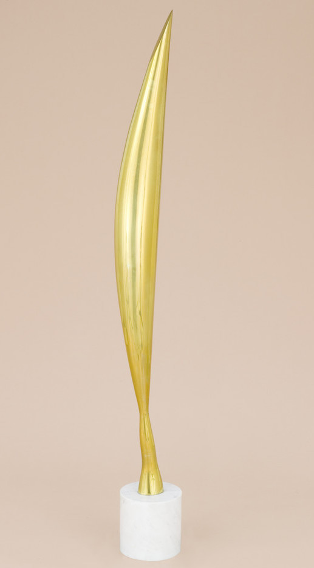
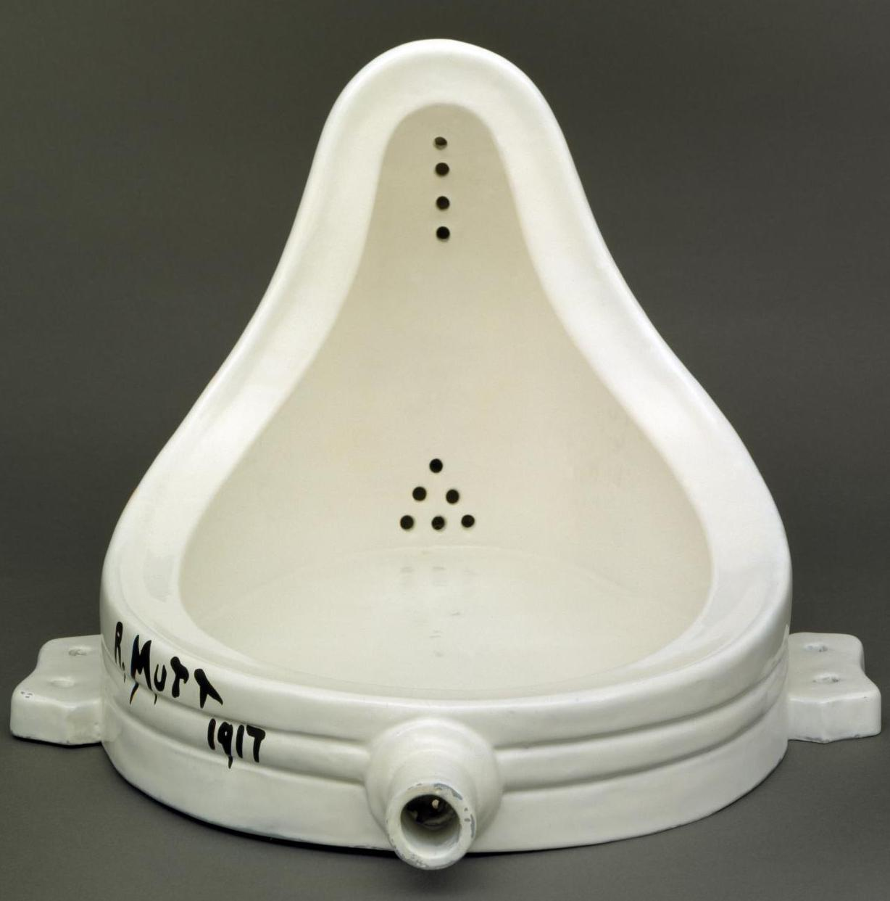
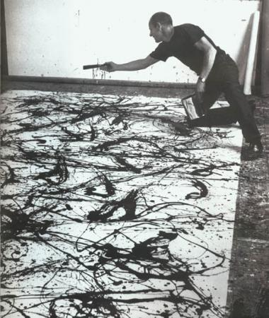
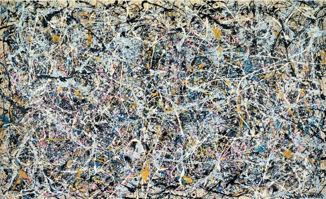
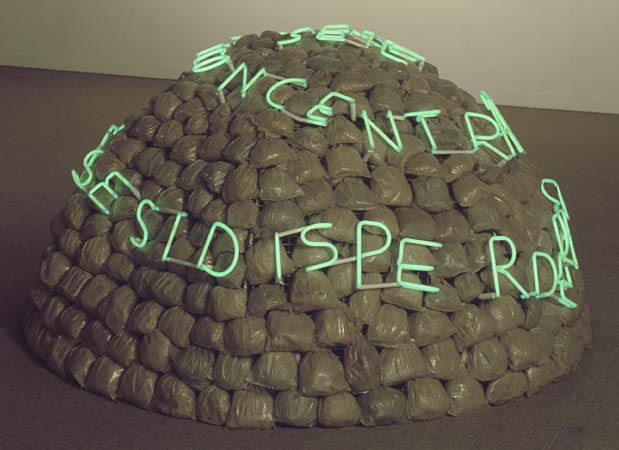
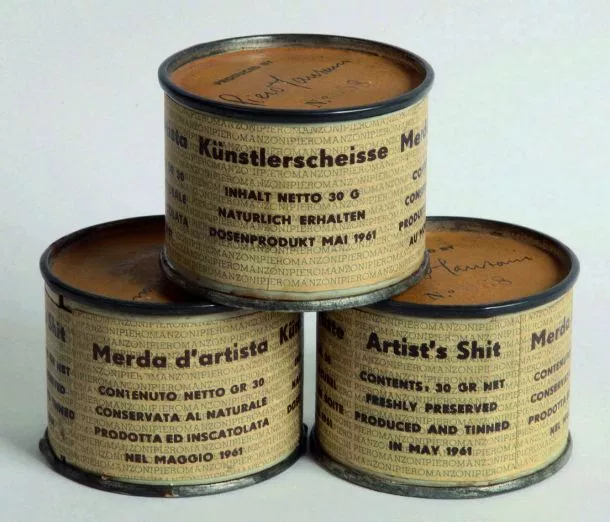

## 1.3. Un artiste qui n’utilise pas de techniques est-il encore un artiste ?
{: .no_toc }

  

    Sommaire
  

  {: .text-delta }
- TOC
{:toc}

### Exercice 

{: .highlight }
Voir les œuvres d’art contemporain ci-dessous.  
Peut-on encore parler d’art quand les artistes abandonnent les techniques classiques ?

### Constantin Brancusi

| **Le procès Brancusi contre États-Unis**    Le procès intenté par le sculpteur moderne Constantin Brancusi au gouvernement américain en 1927 fait date dans l’histoire de l’art. Le motif : une loi de 1922 prévoyait aux États-Unis la libre importation des œuvres d’art : elles pouvaient passer la douane sans être taxées. Mais les douanes de New York veulent taxer la sculpture “*Bird in space*”, au motif qu’il s’agit d’une pièce industrielle et non d’une œuvre d’art. Le procès fait grand bruit car il incarne la bataille idéologique entre le conservatisme et les avant-gardes artistiques du début du XXe siècle, qui remettent en question le rôle figuratif de l’art.  |     |

### Marcel Duchamp

| **Marcel Duchamp, *Foutain* (1917)**     |
|------|
| 

    | 
| Fontaine (en anglais : Fountain) est un ready-made de Marcel Duchamp consistant en un urinoir en porcelaine renversé signé « R. Mutt » et daté de 1917. Fountain fut refusée lors de la première exposition de la Société des artistes indépendants de New York en 1917 avant de disparaître. Il n'en existe que des répliques, certifiées par Marcel Duchamp et réalisées dans les années 1950 et 1960. Fontaine passe pour l'œuvre la plus controversée de l'art du XXe siècle et joue un rôle majeur dans le passage de l'art moderne à l'art contemporain. |

<iframe width="560" height="315" src="https://www.youtube.com/embed/45nChbhuOJs?si=_w4smDBYk9kJAJ48" title="YouTube video player" frameborder="0" allow="accelerometer; autoplay; clipboard-write; encrypted-media; gyroscope; picture-in-picture; web-share" referrerpolicy="strict-origin-when-cross-origin" allowfullscreen></iframe>

<iframe width="560" height="315" src="https://www.youtube.com/embed/KKDgFpSkj6I?si=xzwugHNSFDfWXenQ" title="YouTube video player" frameborder="0" allow="accelerometer; autoplay; clipboard-write; encrypted-media; gyroscope; picture-in-picture; web-share" referrerpolicy="strict-origin-when-cross-origin" allowfullscreen></iframe>

### Jackson Pollock

| **Jackson Pollock (1912 - 1956)** est un peintre américain, célèbre représentant du courant de l'expressionnisme abstrait. La pratique du _all-over_ (déposer la peinture de manière homogène sur la toile) ainsi que du *dripping* (laisser couler la peinture sur la toile), qu'il a beaucoup employé de 1947 à 1950, l'a rendu célèbre.  |   | 

| ***Number One* (1949)**   |
|  Dans l’œuvre *Number One* de 1949, on peut ainsi voir que  la matière s’échappe largement de la toile pour atterrir sans doute sur le sol du petit atelier ou même sur les toiles qui bordent les murs.  |
| 

   |

<iframe width="560" height="315" src="https://www.youtube.com/embed/hHZkKch9k6A?si=qwLIy5P0tiKw9SSu" title="YouTube video player" frameborder="0" allow="accelerometer; autoplay; clipboard-write; encrypted-media; gyroscope; picture-in-picture; web-share" referrerpolicy="strict-origin-when-cross-origin" allowfullscreen></iframe>

### Mario Merz

| **Mario Merz, _Igloo de Giap_ (1968)**     | 
|  Mouvement d’avant-garde apparu en Italie dans les années 1960, l’arte povera incarne une défiance vis-à-vis de la société de consommation (notamment celle de l’impérialisme américain), privilégiant l’usage de matériaux simples, souvent des éléments naturels ou de récupération. C’est une forme d’art dans laquelle prédominent la dimension conceptuelle et celle du nomadisme. L’arte povera fut une attitude politiquement contestatrice, symbolisant l’esprit de la décroissance avant l’heure, et qui s’employa à décloisonner les pratiques artistiques.  |
|  

     |

### Piero Manzoni

|  **Piero Manzoni, *Merda d’artista* (1961)**     |
|  *Merde d'artiste* (ou en italien Merda d’artista) est une œuvre de l’artiste italien Piero Manzoni influencée par les ready-mades de Marcel Duchamp. L'œuvre réalisée en 1961 se compose de 90 boîtes de conserve cylindriques en métal (4,8 × 6 cm), hermétiquement fermées, qui contiennent les excréments de l'artiste, étiquetées, numérotées et signées. |
|   

  |

 

<iframe width="560" height="315" src="https://www.youtube.com/embed/TvF_AFr7UK0?si=Z2U_iEZpHMVTWbUM" title="YouTube video player" frameborder="0" allow="accelerometer; autoplay; clipboard-write; encrypted-media; gyroscope; picture-in-picture; web-share" referrerpolicy="strict-origin-when-cross-origin" allowfullscreen></iframe>

