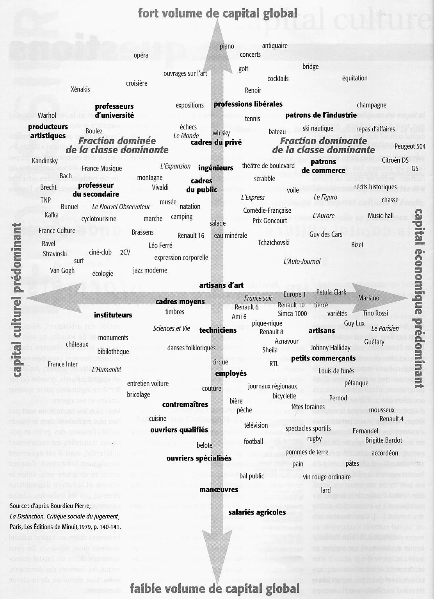

## 2.1. L’artiste recherche-t-il la beauté ?
{: .no_toc }

  

    Sommaire
  

  {: .text-delta }
- TOC
{:toc}

`Art, Nature`

### *L’art, imitation de la nature*

| Aristote, *Poétique* (IVe s. av. J.-C.)                      |
| ------------------------------------------------------------ |
| Le fait d'imiter est inhérent à la nature humaine dès l'enfance ; et ce qui fait différer l'homme d'avec les autres animaux, c'est qu'il en est le plus enclin à l'imitation : les premières connaissances qu'il acquiert, il les doit à l'imitation , et tout le monde goûte les imitations.   (...)  Et en effet, si l'on se plaît à voir des représentations d'objets, c'est qu'il arrive que cette contemplation nous instruit et nous fait raisonner sur la nature de chaque chose (...).   Comme le fait d'imiter, ainsi que l'harmonie et le rythme, sont dans notre nature (...), dès le début, les hommes qui avaient le plus d'aptitude naturelle pour ces choses ont, par une lente progression, donné naissance à la poésie. |
| *Pourquoi l’artiste imite-t-il la nature, selon Aristote ?*  |

{: .highlight }
Voir les [imitations de la nature](/../philotg/docs/L9/L9-3-1-1.html),  [l'idée d'harmonie chez les Grecs](/../philotg/docs/L9/L9-3-1-2.html) et [L'homme de Vitruve](/../philotg/docs/L9/L9-3-1-3.html).

### *Beauté naturelle et beauté artistique*

> « *La beauté naturelle est une belle chose ; une beauté artistique est une belle représentation d’une chose.* »  
> Emmanuel Kant, _Critique de la faculté de juger_ (1790)

{: .highlight }
Voir les [tableaux de Crivelli et Rembrandt](/../philotg/docs/L9/L9-3-1-4.html).  
Utilisez-les pour expliquer la citation de Kant.

### *La relativité du beau*

| Voltaire, Dictionnaire philosophique (1764)                  |
| ----------------------------- |
| Demandez à un crapaud ce que c’est que la beauté (...) : il vous répondra que c’est sa crapaude avec deux gros yeux ronds sortant de sa petite tête, une gueule large et plate (...) J’assistais un jour à une tragédie auprès d’un philosophe ; que cela est beau ! disait-il. (...) Nous fîmes un voyage en Angleterre : on y joua la même pièce parfaitement traduite ; elle fit bâiller tous les spectateurs. (...) Il conclut, après bien des réflexions, que le beau est très relatif (...) et il s’épargna la peine de composer un long traité sur le beau. |
| *En quoi la beauté est-elle relative, selon Voltaire ?*      |

| Pierre Bourdieu      |  *La Distinction* (1979)  |
| ----------------------------- | ------------------ |
| Contre l’idéologie charismatique qui tient les goûts en matière de culture légitime pour un don de nature, l'observation scientifique montre que les besoins culturels sont les produits de l'éducation : l'enquête établit que toutes les pratiques culturelles (fréquentation de musées, des concerts, des expositions, lecture etc.) et les préférences en matière de littérature, de peinture ou de musique, sont étroitement liées au niveau d’instruction (mesuré au titre scolaire ou au nombre d’années d’études), et secondement à l’origine sociale. |   |
| *1. Qu’est-ce qui détermine les goûts en matière d’art, selon Bourdieu ?* | *2. À quelle thèse s’oppose-t-il en affirmant cela ?* | 

{: .highlight }
Voir les différentes [représentations de Venus](/../philotg/docs/L9/L9-3-1-5.html).   
Expliquez en quoi elle nous prouvent la relativité du beau.

 