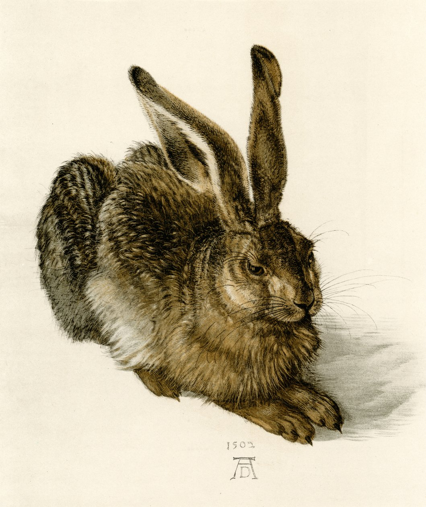
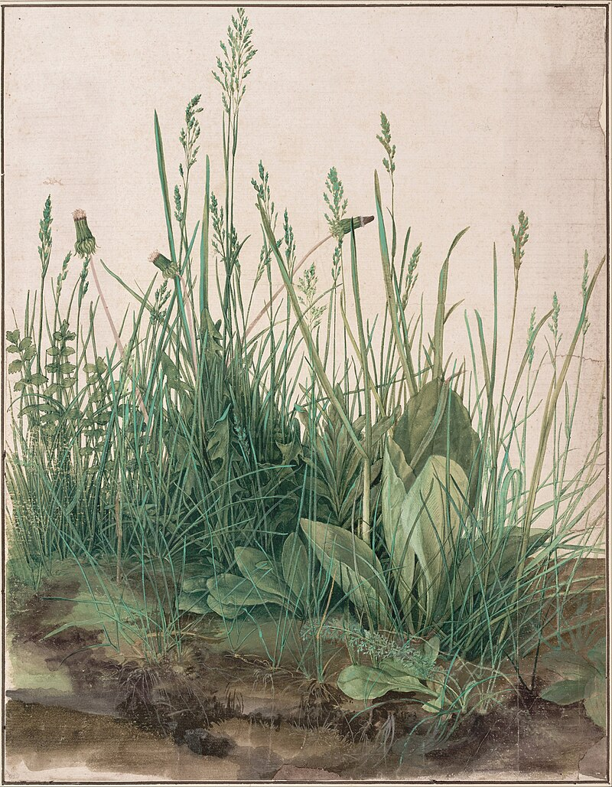

## Imitations de la nature
{: .no_toc }

  

    Sommaire
  

  {: .text-delta }
- TOC
{:toc}

### Albrecht Dürer (XVIe s.)   

| *Le lièvre* (1503) |
|-----------|
| ***Le Lièvre*** est une aquarelle et gouache réalisée en 1502 par l'artiste allemand Albrecht Dürer. Le dessin, effectué en atelier, est reconnu comme un chef-d’œuvre d'observation d'après nature du peintre, à l'égal de la *Grande Touffe d'herbes* réalisée l'année suivante. Dürer a d'abord légèrement esquissé les formes, puis a appliqué une sous-couche brune à l'aquarelle. Grâce à une grande variété de coups de pinceau bruns sombres et clairs, à l'aquarelle et la gouache, il a ensuite patiemment figuré les différentes textures du pelage, des longues touffes soyeuses du ventre et des cuisses jusqu'à celles plus courtes de l'arrière-train. Ensuite ont été individualisés, un à un, les poils blancs du pelage, ainsi que les vibrisses du museau. Le pelage de l'animal adulte a finalement été renforcé par des traits de pinceau noir. |    
| 

     | 

| *Grande Touffe d'herbes* (1504) |
|-----------|
| 

    |

### Oiseaux

#### Chant de Rossignol

<iframe width="560" height="315" src="https://www.youtube.com/embed/fjr6pYSoL_I?si=N-BiGTcsuYCsAO5U" title="YouTube video player" frameborder="0" allow="accelerometer; autoplay; clipboard-write; encrypted-media; gyroscope; picture-in-picture; web-share" referrerpolicy="strict-origin-when-cross-origin" allowfullscreen></iframe>

#### Louis Jullien, *Le Rossignol*

<iframe width="560" height="315" src="https://www.youtube.com/embed/0PBIV5Wc-no?si=t8njRsFZF_x4PzTe" title="YouTube video player" frameborder="0" allow="accelerometer; autoplay; clipboard-write; encrypted-media; gyroscope; picture-in-picture; web-share" referrerpolicy="strict-origin-when-cross-origin" allowfullscreen></iframe>

#### Olivier Messian, *Catalogue d’oiseaux*

<iframe width="560" height="315" src="https://www.youtube.com/embed/biJCU8jK3x4?si=ci5ap43jmJ-w6Fjh" title="YouTube video player" frameborder="0" allow="accelerometer; autoplay; clipboard-write; encrypted-media; gyroscope; picture-in-picture; web-share" referrerpolicy="strict-origin-when-cross-origin" allowfullscreen></iframe>