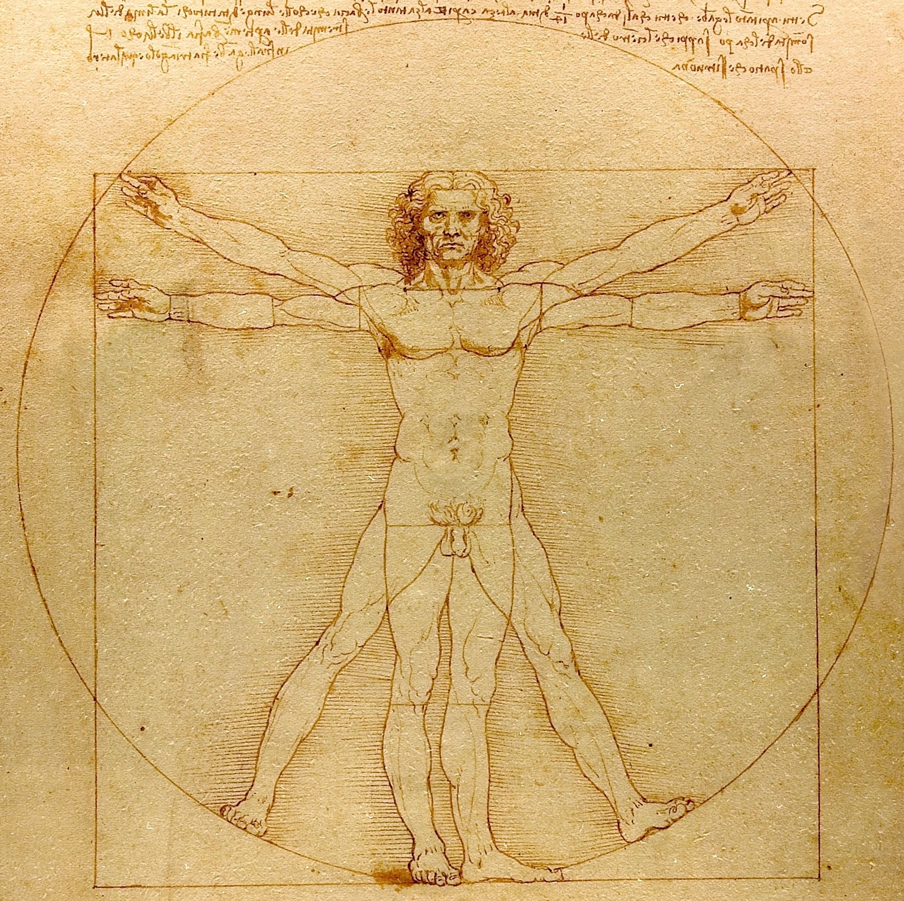

## L'homme de Vitruve

| Léonard De vinci, *L’homme de Vitruve* (1490)     |     
| -------------------------- | 
| *L’Homme de Vitruve* est un dessin réalisé vers 1490 à la plume, encre et lavis sur papier, par Léonard de Vinci (1452-1519), d'après une étude de l’important traité d'architecture antique *De architectura* rédigé vers -25 par l'architecte ingénieur romain Vitruve (v-90-v-15), et dédié à l’empereur romain Auguste.   Vitruve écrit dans ce traité : « _Pour qu’un bâtiment soit beau, il doit posséder une symétrie et des proportions parfaites comme celles qu’on trouve dans la nature_ ».   De Vinci s’en inspire pour dessiner les proportions idéales du corps humain parfaitement inscrit dans un cercle (centre : le nombril) et un carré (centre : les organes génitaux). L'Homme de Vitruve est un symbole de l’Humanisme qui place l'Homme au centre de tout. | 
| 

  |

<iframe width="560" height="315" src="https://www.youtube.com/embed/aMsaFP3kgqQ?si=tey6UnKsPp7DQr8I" title="YouTube video player" frameborder="0" allow="accelerometer; autoplay; clipboard-write; encrypted-media; gyroscope; picture-in-picture; web-share" referrerpolicy="strict-origin-when-cross-origin" allowfullscreen></iframe>

