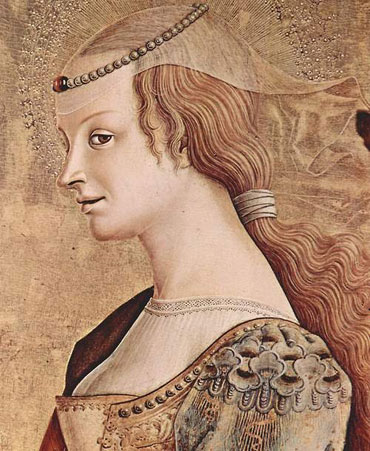
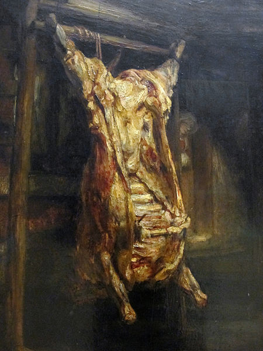

## Les belles représentations de choses

| Carlo Crivelli, *Marie-Madeleine (détail)* (1470)    | Rembrandt, *Le Bœuf écorché* (1655)     |
| -------------------------- | ---------------- |
| 

  | 

    |
| Sainte Marie Madeleine est un panneau de bois de 174 × 54 cm peint à la détrempe et à l'or sur panneau de bois réalisé vers 1471 par Carlo Crivelli. Le regard de profil, souriant au regard orienté vers le spectateur, fait allusion à son passé en tant que courtisane. Son attitude brise l'atmosphère de sérieux véhiculée par les autres personnages et ramène le spectateur dans une dimension plus humaine | *Le Bœuf écorché* est un tableau peint par Rembrandt en 1655. Il mesure 94 cm de haut sur 69 cm de large. Il est conservé au musée du Louvre à Paris. Rembrandt s'intéresse ici au rendu des matières. Il avait observé ce modèle sur le vif, et le transcrit dans des empâtements huileux, ce qui crée un double effet d'attirance et de dégoût. |

