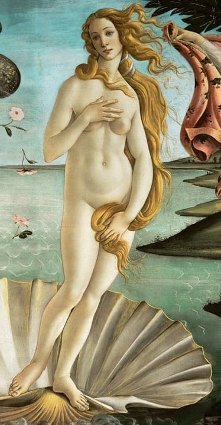
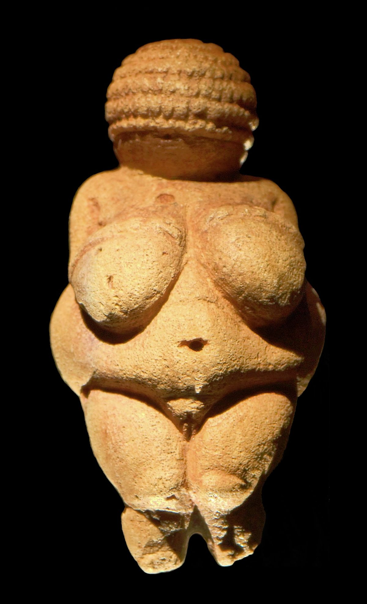
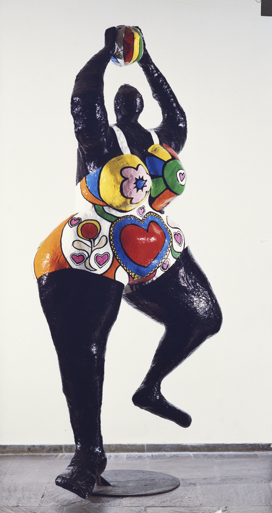

## Représentations de Venus    

{: .highlight }
Voir ces différentes représentations de Venus.    
Expliquez en quoi elle nous prouvent la relativité du beau.

| Botticelli, *La naissance de Venus (détail)* (1485) | *Vénus de Willendorf* (Paléolithique) | Niki de Saint Phalle, _Black Venus_ (1965) |
|------------------ |------------------ |------------------ |
| <a href="../../assets/img/art/botticelli-venus.jpeg" target="_blank"> | <a href="../../assets/img/art/venus-willendorf.jpeg" target="_blank">  | <a href="../../assets/img/art/stphalle-venus.jpeg" target="_blank">  |
| *La Naissance de Vénus* est un tableau de Sandro Botticelli, peint vers 1484-1485 et conservé à la galerie des Offices à Florence (Italie). Il représente la déesse Vénus arrivant sur le rivage après sa naissance. | La Vénus de Willendorf est une statuette en calcaire du Paléolithique supérieur, attribuée au Gravettien, découverte lors de travaux de construction sur une ligne de chemin de fer en 1908 à Willendorf, en Autriche. Elle est conservée au Musée d'histoire naturelle de Vienne, en Autriche. | _Black Venus_ est une sculpture de Niki de Saint Phalle en polyester peint de presque trois mètres de haut, conservée à New York au *Whitney Museum of American Art*. L’œuvre témoigne de la solidarité de l’artiste française pour les mouvements des droits civiques des Afro-Américains. |