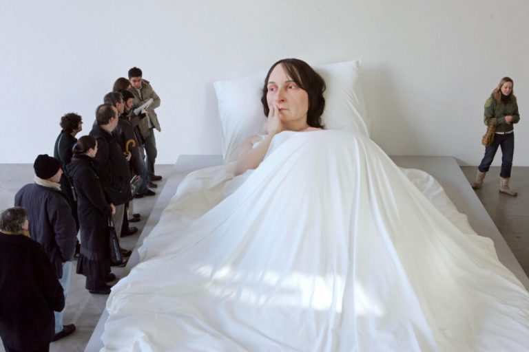

## Représentations de lits

| _La Chambre de Van Gogh à Arles_ (1886)   | 
|------------------ |
| 

  |
| La Chambre de Van Gogh à Arles est une peinture à l'huile sur toile de 72 × 90 cm. Elle a été réalisée par le peintre Vincent van Gogh en 1888. Elle se trouve au musée Van-Gogh à Amsterdam. |

| Tracey Emin, My Bed (1998) | Ron Mueck, *In Bed* (2005)   |
| ---------------------- | ------------------ | 
| <a href="../../assets/img/art/emin-bed.jpeg" target="_blank">  | <a href="../../assets/img/art/mueck-inbed.jpeg" target="_blank">  |
|  Tracey Emin est une artiste britannique née en 1963. En 1998, elle expose _My Bed_ à la Tate Gallery de Londres. L’installation présente un lit dans lequel elle aurait passé plusieurs jours, accablée de chagrin, suite à une rupture amoureuse. Le public s’indigne : les draps sont tâchés, le sol est jonché de préservatifs, de mouchoirs usagés et autres cadavres de bouteilles. | _In Bed_ est une œuvre de Ron Mueck qui représente une femme de 6 mètres de long au regard soucieux. L’œuvre est acquise par la Fondation Cartier pour l’art contemporain en 2006. Figure majeure de l’hyperréalisme, Mueck s’est fait connaître pour sa production de sculptures aux proportions démesurées, qu’elles soient gigantesques ou minuscules.  Il sculpte les corps et les visages avec minutie : pilosité, rougeurs, cernes et rides sont fidèlement reproduits. |

