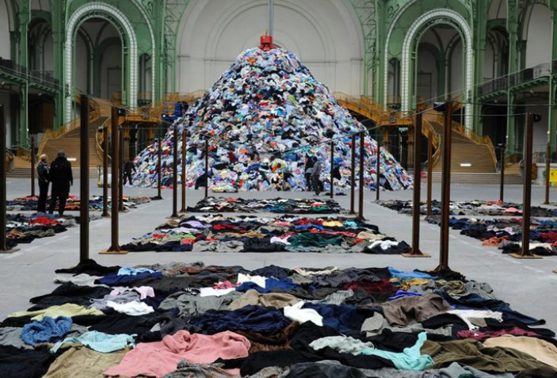
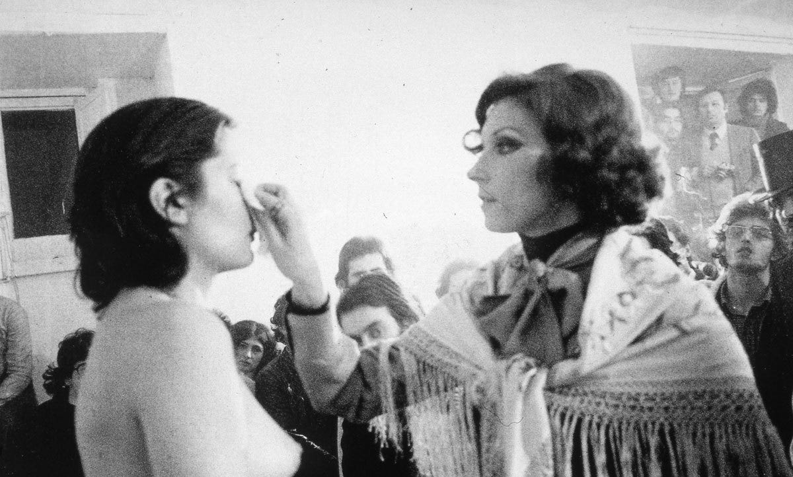
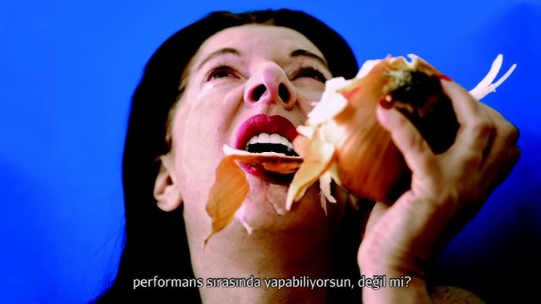
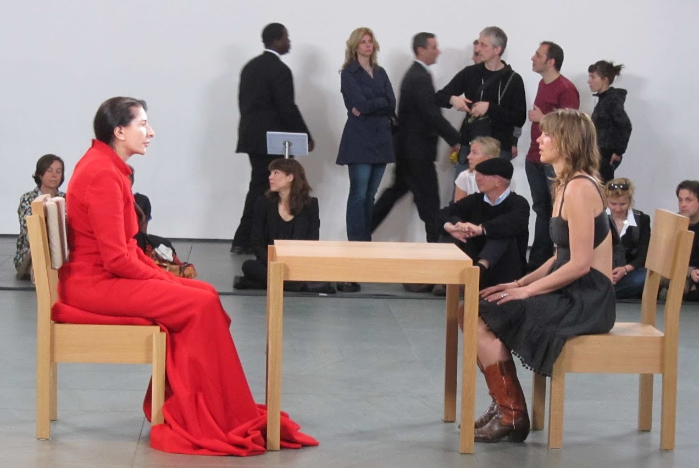

## L'art et la morale
{: .no_toc }

  

    Sommaire
  

  {: .text-delta }
- TOC
{:toc}

{: .highlight }
Voir les œuvres suivantes de Boltanski, Abramović et Serrano.     
Expliquez en quoi l’art peut poursuivre un but moral ou au contraire le rejeter.

### Christian Boltanski

| Christian Boltanski    |       *Personnes* (2010)   |
| -------------------------- | ---------------------------- |
| *Personnes* est le titre d'une installation artistique de Christian Boltanski. Elle a été présentée au public lors de l'exposition Monumenta au Grand Palais à Paris en 2010. L’œuvre fait référence à la Shoa. Elle débute par un mur de ferraille. Le spectateur peut entendre des battements de cœur. Des boîtes rouillées empilées contenant des archives sont alignées le long d'un mur sur 42 mètres de longueur. Elles sont surmontées de lampes. Chaque boîte porte une étiquette numérotée. | Plus loin, 69 espaces rectangulaires sont alignés sur trois rangées le long de la nef sur près de 200 mètres. Chacun de ces rectangles est recouvert de vêtements posés à plat au sol, face contre terre. Enfin, sous la coupole de la nef se trouve un amoncellement de vêtements mesurant environ 15 mètres de hauteur. À son sommet, un grappin relié à une grue de chantier prélève quelques-uns de ces vêtements, les soulève dans les airs avant de les relâcher. |       
| 

   | 

  |

#### Personnes

<iframe width="560" height="315" src="https://www.youtube.com/embed/Lv7tatnhFAc?si=0zmmK03dq_izQiGt" title="YouTube video player" frameborder="0" allow="accelerometer; autoplay; clipboard-write; encrypted-media; gyroscope; picture-in-picture; web-share" referrerpolicy="strict-origin-when-cross-origin" allowfullscreen></iframe>

### Marina Abramović

{: .highlight }
Née le 30 novembre 1946 à Belgrade, Marina Abramović est une artiste contemporaine serbe performeuse. Connue à l’échelle mondiale pour des performances aux caractères violents et provocant, elle fait partie du courant artistique de l'art corporel. 

|  *Rythm 0* (1974)   | *The artist is present* (2010)  | *The Onion* (1995)  |
| ----------------------- | --------------------- | ------------------ |
| 

   | 

   | 

    |
| En 1974 l'artiste réalise la performance *Rhythm 0*, où elle se laisse manipuler par le public avec les objets de leurs choix (fleurs, plumes, couteaux, armes à feu...)   | En 1995, à travers sa performance _The onion_, l’artiste dénonce l’extermination de huit mille bosniaques par l’armée serbe. Dans cette performance vidéo, nous pouvons voir l’artiste manger un oignon cru en pleurant de dégoût, tout en se plaignant de sa vie. | Du 7 mars au 31 mai 2010, pendant soixante-quinze jours, Marina Abramovic est restée assise sept heures par jour devant une table dans l’atrium du MoMA de New York. Habillée selon les jours d’une longue robe rouge, blanche ou bleue, elle s’est offerte aux regards des visiteurs qui venaient librement s’assoir face à elle.  |

#### Rythm 0

<iframe width="560" height="315" src="https://www.youtube.com/embed/TdFyVyS0N7k?si=qRRl98Ccm4kO90IA" title="YouTube video player" frameborder="0" allow="accelerometer; autoplay; clipboard-write; encrypted-media; gyroscope; picture-in-picture; web-share" referrerpolicy="strict-origin-when-cross-origin" allowfullscreen></iframe>

#### The Onion

<iframe width="560" height="315" src="https://www.youtube.com/embed/ISZGZw5LQvo?si=bANDDUlnBIJYaCmd" title="YouTube video player" frameborder="0" allow="accelerometer; autoplay; clipboard-write; encrypted-media; gyroscope; picture-in-picture; web-share" referrerpolicy="strict-origin-when-cross-origin" allowfullscreen></iframe>

#### The artist is present

<iframe width="560" height="315" src="https://www.youtube.com/embed/ryd__J7nits?si=1pkujVKCOBAtejnp" title="YouTube video player" frameborder="0" allow="accelerometer; autoplay; clipboard-write; encrypted-media; gyroscope; picture-in-picture; web-share" referrerpolicy="strict-origin-when-cross-origin" allowfullscreen></iframe>
