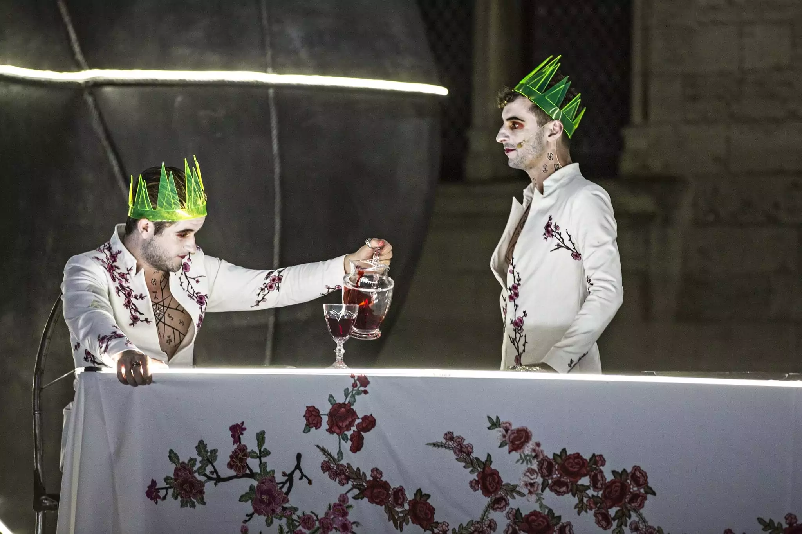

## Sénèque, *Thyeste* (Ier s.)  

| *Thyeste* est une tragédie de l'auteur romain Sénèque écrite au Ier siècle ap. J.-C. Elle est connue pour la violence de ses scènes illustrant la rivalité entre les deux frères Atrée et Thyeste et en montrant des faits d’infanticide et de cannibalisme. Alors qu'Atrée règne en paix sur Mycènes, son jumeau, Thyeste, séduit sa femme. Atrée se venge de son frère en tuant ses enfants et en les lui servant à dîner. Cette tragédie a été montée en 2018 par le dramaturge Thomas Jolly et présentée au festival d’Avignon dans le Cour d’honneur de la Cité des Papes. |  
| 

    Photographie de la pièce *Thyeste* (Thomas Joly, 2018). Athée invite Thyeste à boire le vin dans lequel se trouve le sang de ses fils.   | 

 <iframe style="width:100%;height:100%;position:absolute;left:0px;top:0px;overflow:hidden" frameborder="0" type="text/html" src="https://www.dailymotion.com/embed/video/x6yrkri" width="100%" height="100%" allowfullscreen title="Dailymotion Video Player" > </iframe> 

