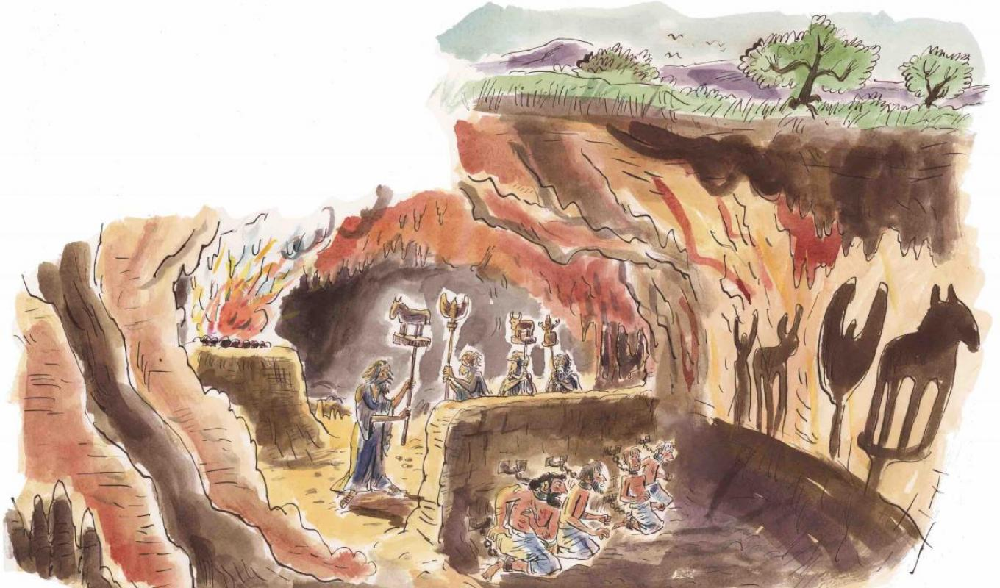

{: .no_toc }

  

    Sommaire
  

  {: .text-delta }
- TOC
{:toc}

  
``Image : Jean Harambat pour Philosophie Magazine``

 

### L'allégorie de la caverne

 

>**SOCRATE -** Représente-toi de la façon que voici l'état de notre nature relativement à l'instruction et à l'ignorance. Figure-toi des hommes dans une demeure souterraine, en forme de caverne, ayant sur toute sa largeur une entrée ouverte à la lumière. Ces hommes sont là depuis leur enfance, les jambes et le cou enchaînés, de sorte qu'ils ne peuvent bouger ni voir ailleurs que devant eux, la chaîne les empêchant de tourner la tête. La lumière leur vient d'un feu allumé sur une hauteur, au loin derrière eux. Entre le feu et les prisonniers passe une route élevée. Imagine que le long de cette route est construit un petit mur, pareil aux cloisons que les montreurs de marionnettes dressent devant eux, et au-dessus desquelles ils font voir leurs merveilles.  
**GLAUCON -** Je vois cela.  
**SOCRATE -** Figure-toi maintenant le long de ce petit mur des hommes portant des objets de toute sorte, qui dépassent le mur, et des statuettes d'hommes et d'animaux, en pierre, en bois et en toute espèce de matière. Naturellement, parmi ces porteurs, les uns parlent et les autres se taisent.  
**GLAUCON -** Voilà, un étrange tableau et d'étranges prisonniers.  
**SOCRATE -** Ils nous ressemblent, répondis-je. Penses-tu que dans une telle situation ils n'aient jamais vu autre chose d'eux mêmes et de leurs voisins que les ombres projetées par le feu sur la paroi de la caverne qui leur fait face ?
Comment cela se pourrait-il s'ils sont forcés de rester la tête immobile durant toute leur vie ?
Et pour les objets qui défilent n'en est-il pas de même ?  
**GLAUCON -** Sans contredit.  
**SOCRATE -** Mais, dans ces conditions, s'ils pouvaient se parler les uns aux autres, ne penses-tu pas qu'ils croiraient nommer les objets réels eux-mêmes en nommant ce qu'ils voient ?  
**GLAUCON -** Nécessairement.  
**SOCRATE -** Et s'il y avait aussi dans la prison un écho que leur renverrait la paroi qui leur fait face, chaque fois que l'un de ceux qui se trouvent derrière le mur parlerait, croiraient-ils entendre une autre voix, à ton avis, que celle de l'ombre qui passe devant eux ?  
**GLAUCON -** Non par Zeus.  
**SOCRATE -** Assurément, de tels hommes n'attribueront de réalité qu'aux ombres des objets fabriqués.  
**GLAUCON -** De toute nécessité.  
**SOCRATE -** Considère maintenant ce qui leur arrivera naturellement si on les délivre de leurs chaînes et qu'on les guérisse de leur ignorance. Qu'on détache l'un de ces prisonniers, qu'on le force à se dresser immédiatement, à tourner le cou, à marcher, à lever les yeux vers la lumière. En faisant tous ces mouvements il souffrira, et l'éblouissement l'empêchera de distinguer ces objets dont tout à l'heure il voyait les ombres. Que crois-tu donc qu'il répondra si quelqu'un vient lui dire qu'il n'a vu jusqu'alors que de vains fantômes, mais qu'à présent, plus près de la réalité et tourné vers des objets plus réels, il voit plus juste ? Si, enfin, en lui montrant chacune des choses qui passent, on l'oblige, à force de questions, à dire ce que c'est, ne penses-tu pas qu'il sera embarrassé, et que les ombres qu'il voyait tout à l'heure lui paraîtront plus vraies que les objets qu'on lui montre maintenant ?  
**GLAUCON -** Beaucoup plus vraies.  
**SOCRATE -** Et si on le force à regarder la lumière elle-même, ses yeux n'en seront-ils pas blessés ? N'en fuira-t-il pas la vue pour retourner aux choses qu'il peut regarder, et ne croira-t-il pas que ces dernières sont réellement plus distinctes que celles qu'un lui montre ?  
**GLAUCON -** Assurément.  
**SOCRATE -** Et si, reprise-je, on l'arrache de sa caverne, par force, qu'on lui fasse gravir la montée rude et escarpée, et qu'on ne le lâche pas avant de l'avoir traîné jusqu'à la lumière du soleil, ne souffrira-t-il pas vivement et ne se plaindra-t-il pas de ces violences ? Et lorsqu'il sera parvenu à la lumière, pourra-t-il, les yeux tout éblouis par son éclat, distinguer une seule des choses que maintenant nous appelons vraies ?  
**GLAUCON -** Il ne le pourra pas, du moins au début.  
**SOCRATE -** Il aura, je pense, besoin d'habitude pour voir les objets de la région supérieure. D'abord ce seront les ombres qu'il distinguera le plus facilement, puis les images des hommes et des autres objets qui se reflètent dans les eaux, ensuite les objets eux-mêmes. Après cela, il pourra, affrontant la clarté des astres et de la lune, contempler plus facilement pendant la nuit les corps célestes et le ciel lui-même, que pendant le jour le soleil et sa lumière.  
**GLAUCON -** Sans doute.  
**SOCRATE -** À la fin, j'imagine, ce sera le soleil, non ses vaines images réfléchies dans les eaux ou en quelque autre endroit, mais le soleil lui-même à sa vraie place, qu'il pourra voir et contempler tel qu'il est.  
**GLAUCON -** Nécessairement.  
**SOCRATE -** Après cela il en viendra à conclure au sujet du soleil, que c'est lui qui fait les saisons et les années, qui gouverne tout dans le monde visible, et qui, d'une certaine manière, est la cause de tout ce qu'il voyait avec ses compagnons dans la caverne.  
**GLAUCON -** Évidemment, c'est à cette conclusion qu'il arrivera.  
**SOCRATE -** Or donc, se souvenant de sa première demeure, de la sagesse que l'on y professe, et de ceux qui y furent ses compagnons de captivité, ne crois-tu pas qu'il se réjouira du changement et plaindra ces derniers ?  
**GLAUCON -** Si, certes.  
**SOCRATE -** Et s'ils se décernaient alors entre eux honneurs et louanges, s'ils avaient des récompenses pour celui qui saisissait de l'oeil le plus vif le passage des ombres, qui se rappelait le mieux celles qui avaient coutume de venir les premières ou les dernières, ou de marcher ensemble, et qui par là était le plus habile à deviner leur apparition, penses-tu que notre homme fût jaloux de ces distinctions, et qu'il portât envie à ceux qui, parmi les prisonniers, sont honorés et puissants ? Ou bien, comme le héros d'Homère, ne préférera-t-il pas mille fois n'être qu'un valet de charrue, au service d'un pauvre laboureur, et de souffrir tout au monde plutôt que de revenir à ses anciennes illusions et vivre comme il vivait ?  
**GLAUCON -** Je suis de ton avis, il préférera tout souffrir plutôt que de vivre de cette façon là.  
**SOCRATE -** Imagine encore que cet homme redescende dans la caverne et aille s'asseoir à son ancienne place. N'aura-t-il pas les yeux aveuglés par les ténèbres en venant brusquement du plein soleil ?  
**GLAUCON -** Assurément si.  
**SOCRATE -** Et s'il lui faut entrer de nouveau en compétition, pour juger ces ombres, avec les prisonniers qui n'ont point quitté leurs chaînes, dans le moment où sa vue est encore confuse et avant que [517a] ses yeux se soient remis (puisque l'accoutumance à l'obscurité demandera un certain temps), ne va-t-on pas rire à ses dépens, et ne diront-ils pas qu'étant allé là-haut il en est revenu avec la vue ruinée, de sorte que ce n'est même pas la peine d'essayer d'y monter? Et si quelqu'un tente de les délier et de les conduire en haut, et qu'ils puissent le tenir en leurs mains et tuer, ne le tueront-ils pas ?  
**GLAUCON -** Sans aucun doute.  
>
> ***Platon, "République", livre VII.***

### Vidéo : l'allégorie lue par Orson Welles

<iframe width="560" height="315" src="https://www.youtube.com/embed/2yfePu67xoI" title="YouTube video player" frameborder="0" allow="accelerometer; autoplay; clipboard-write; encrypted-media; gyroscope; picture-in-picture; web-share" allowfullscreen></iframe>
