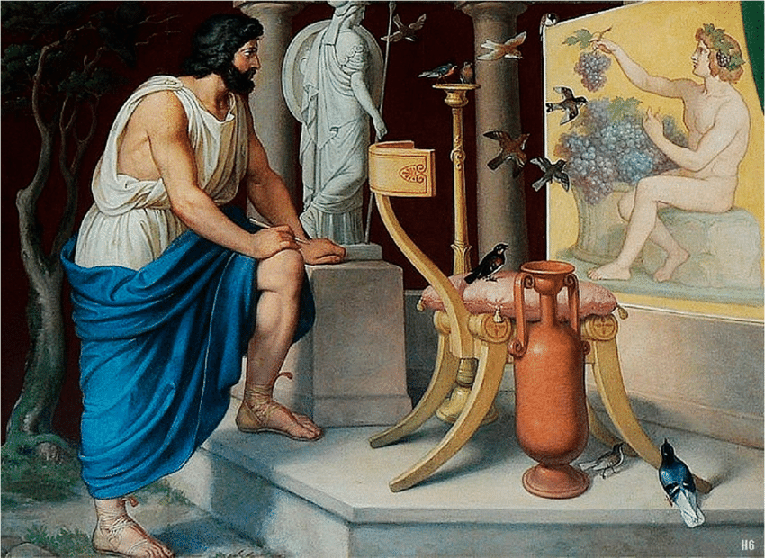

# 1. Qu'est-ce qu'une illusion ?

{: .no_toc }

  

    Sommaire
  

  {: .text-delta }
- TOC
{:toc}

## L'illusion dans l'art

{: .nouveau-title }
> Exercice
>
>1. Que nous dit de l'art cette anecdote sur les peintres Zeuxis et Parrhasius ?
> 2. À l'aide de ce texte, expliquez ce qu'est une illusion.

| ----------------------- | 
|  | Zeuxis eut pour contemporains et pour émules Timanthès, Androcyde, Eupompe, Parrhasius. Ce dernier, dit-on, offrit le combat à Zeuxis. Celui-ci apporta des raisins peints avec tant de vérité, que des oiseaux vinrent les becqueter ; Parrhasius apporta un rideau si naturellement représenté, que Zeuxis, tout fier de la sentence des oiseaux, demande qu’on tirât enfin le rideau pour faire voir le tableau. Alors, reconnaissant son illusion, il s’avoua vaincu avec une franchise modeste, attendu que lui n’avait trompé que des oiseaux, mais que Parrhasius avait trompé un artiste, qui était Zeuxis. |

## Erreur et illusion

| SIGMUND FREUD, _L'Avenir d'une illusion_ (1927)              |
| ------------------------------------------------------------ |
| Une illusion n'est pas la même chose qu'une erreur (...). L'opinion d'Aristote, d'après laquelle la vermine (1) serait engendrée par l'ordure – opinion qui est encore celle du peuple ignorant –, était une erreur ; de même l'opinion qu'avait une génération antérieure de médecins, et d'après laquelle le tabès (2) aurait été la conséquence d'excès sexuels. Il serait impropre d'appeler ces erreurs des illusions, alors que c'était une illusion de la part de Christophe Colomb, quand il croyait avoir trouvé une nouvelle route maritime des Indes. La part de désir que comportait cette erreur est manifeste. (...). Ce qui caractérise l'illusion, c'est d'être dérivée des désirs humains. (...) Ainsi nous appelons illusion une croyance quand, dans la motivation de celle-ci, la réalisation d'un désir est prévalente, et nous ne tenons pas compte, ce faisant, des rapports de cette croyance à la réalité, tout comme l'illusion elle-même renonce à être confirmée par le réel.   *(1) Vermine : ensemble des insectes parasites de l'homme et des animaux (puces, poux, punaises). (2) Tabès : Forme de syphilis touchant la moelle épinière.* |
| **1. Qu'est-ce qui distingue l'erreur de l'illusion, selon Freud ? 2. Qu'est-ce que le contraire de l'illusion, et le contraire de l'erreur ? 3. Donnez trois exemples d'illusion et trois exemples d'erreur non tirés du texte.** |

## L'Apologie de Socrate

{: .highlight }
**L'apologie de Socrate** est un dialogue de Platon qui met en scène le procès de Socrate, accusé d'impiété et d'avoir corrompu la jeunesse. Dans cet extrait, Socrate se défend en expliquant pourquoi, selon lui, il s'est fait des ennemis à Athènes. Il raconte comment l'oracle de Delphes (la Pythie), prétrêsse du dieu Apollon, a un jour affirmé qu'il était l'homme le plus sage d'Athènes.

| PLATON, *Apologie de Socrate* (Ve s. av. J.-C.)              |
| ------------------------------------------------------------ |
| &1. Vous connaissez certainement Chéréphon. Lui et moi, nous étions amis d'enfance (...). Un jour qu'il était allé à Delphes, il osa poser au dieu la question que voici — de grâce, juges, ne vous récriez pas en l'entendant — il demanda donc s'il y avait quelqu'un de plus savant que moi. Or, la Pythie lui répondit que nul n'était plus savant. (...) Lorsque je connus cet oracle, je me dis à moi-même : « *Voyons, que signifie la parole du dieu ? Quel sens y est caché ? J'ai conscience, moi, que je ne suis savant ni peu ni beaucoup. Que veut-il donc dire, quand il affirme que je suis le plus savant ? Il ne parle pourtant pas contre la vérité ; cela ne lui est pas possible*. » Longtemps, je demeurai sans y rien comprendre. Enfin, bien à contrecœur, je me décidai à vérifier la chose de la façon suivante. &2. J'allai trouver un des hommes qui passaient pour savants, certain que je pourrais là, ou nulle part, contrôler l'oracle et ensuite lui dire nettement : « *Voilà quelqu'un qui est plus savant que moi, et toi, tu m'as proclamé plus savant*. » J'examinai donc à fond mon homme ; inutile de le nommer, c'était un de nos hommes d'État ; or, à l'épreuve, en causant avec lui, voici l'impression que j'ai eue, Athéniens. Il me parut que ce personnage semblait savant à beaucoup de gens et surtout à lui-même, mais qu'il ne l'était aucunement. Et alors, j'essayais de lui démontrer qu'en se croyant savant il ne l'était pas. Le résultat fut que je m'attirai son inimitié, et aussi celle de plusieurs des assistants. Je me retirai, en me disant : « *À tout prendre, je suis plus savant que lui. En effet, il se peut que ni l'un ni l'autre de nous ne sache rien de bon ; seulement, lui croit qu'il sait, bien qu'il ne sache pas ; tandis que moi, si je ne sais rien, je ne crois pas non plus rien savoir. Il me semble, en somme, que je suis tant soit peu plus savant que lui, en ceci du moins que je ne crois pas savoir ce que je ne sais pas*. » Après cela, j'en allai trouver un second, un de ceux qui passaient pour encore plus savants. Et mon impression fut la même. Du coup, je m'attirai aussi l'inimitié de celui-ci et de plusieurs autres. (...) &3. Telle fut, Athéniens, l'enquête qui m'a fait tant d'ennemis, des ennemis très passionnés, très malfaisants, qui ont propagé tant de calomnies et m'ont fait ce renom de savant. Car, chaque fois que je convaincs quelqu'un d'ignorance, les assistants s'imaginent que je sais tout ce qu'il ignore. En réalité, juges, c'est probablement le dieu qui le sait, et, par cet oracle, il a voulu déclarer que la science humaine est peu de chose ou même qu'elle n'est rien. Et, manifestement, s'il a nommé Socrate, c'est qu'il se servait de mon nom pour me prendre comme exemple. Cela revenait à dire : « *Ô humains, celui-là, parmi vous, est le plus savant qui sait, comme Socrate, qu'en fin de compte son savoir est nul*. » |
| **1.  (&1 et début &2) Que dit l'oracle de Delphes de Socrate ? Pourquoi Socrate est-il étonné de cette affirmation ? Comment va-t-il réagir ? 2.  (&2) Quelle découverte Socrate fait-il après avoir interrogé un homme d'État athénien ? 3.  (&3) Comment Socrate interprète-t-il finalement les paroles de l'oracle de Delphes ? 4. En quoi les Athéniens sont-il dans l'illusion et en quoi, au contraire, Socrate est-il clairvoyant ? 5. Servez-vous de la dernière phrase du texte pour donner une définition du philosophe ? Aidez-vous pour répondre de l'étymologie grecque du mot philosophie (philia = amour, désir ; sophia = sagesse)** |

### Complément : croire et savoir

|      |      |

{: .nouveau-title }
>EXERCICE 
>
>1. Reproduire et remplir le tableau suivant
>2. Synthétiser le tableau en expliquant ce qui distingue la croyance du savoir

|                                                | "Je crois que..." | "Je crois en..." | "Je sais que..." |
| ---------------------------------------------- | ----------------- | ---------------- | ---------------- |
| Trouver des  synonymes  et illustrer |                   |                  |                  |
| Définir                                        |                   |                  |                  |
| Synthèse                                       |                   |                  |                  |
