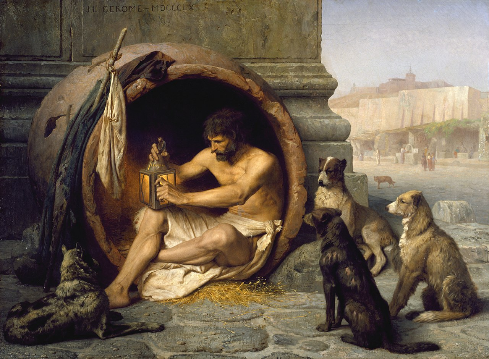

# 3. Le rejet de l'illusion

{: .no_toc }

  

    Sommaire
  

  {: .text-delta }
- TOC
{:toc}

## Un imbécile satisfait ou un Socrate insatisfait ?

| JOHN STUART MILL, *L'utilitarisme* (1861)                    |
| ------------------------------------------------------------ |
| Peu de créatures humaines accepteraient d'être changées en animaux inferieurs sur la promesse de la plus large ration de plaisirs de bêtes ; aucun être humain intelligent ne consentirait à être un imbécile, aucun homme instruit à être un ignorant, aucun homme ayant du cœur et une conscience à être égoïste et vil, même s'ils avaient la conviction que l'imbécile, l'ignorant ou le gredin sont, avec leurs lots respectifs, plus complètement satisfaits qu'eux-mêmes avec le leur. (…) Un être pourvu de facultés supérieures demande plus pour être heureux, est probablement exposé à souffrir de façon plus aiguë, et offre certainement à la souffrance plus de points vulnérables qu'un être de type inferieur, mais en dépit de ces risques, il ne peut jamais souhaiter réellement tomber à un niveau d'existence qu'il sent inferieur. Nous pouvons donner de cette répugnance le nom qu'il nous plaira (…) mais si on veut l'appeler de son vrai nom, c'est un sens de la dignité que tous les êtres humains possèdent, sous une forme ou sous une autre, et qui correspond (…) au développement de leurs facultés supérieures. (…) Il vaut mieux être un homme insatisfait qu'un porc satisfait ; il vaut mieux être Socrate insatisfait qu'un imbécile satisfait. |
| **1. Quelle question pose implicitement J. S. Mill dans ce texte ?  2. Selon lui, que répondrait la plupart des gens à cette question, et pourquoi ?  3. Êtes-vous d’accord avec sa dernière affirmation : « *Il vaut mieux être un homme insatisfait qu'un porc satisfait ; il vaut mieux être Socrate insatisfait qu'un imbécile satisfait.* » ?** |

### Complément : la vie de Diogène le Cynique

{: .highlight }
**Que répondrait selon vous Diogène à J.S. Mill et  comment se justifierait-il ?**

| ----------------------- | 
|  **Diogène de Sinope est un philosophe grec de la fin du Ve siècle avant J.-C., il était surnommé « Le Cynique », du grec *kunos*, qui signifie « chien ». Dormant dans une amphore, équipé seulement d’un manteau à l’étoffe grossière, d’une besace et d’un bâton, Diogène erre pieds nus dans les rues, mendie, harcèle ses semblables, urine et se masturbe en public… Diogène manie un franc-parler dévastateur et se compare volontiers à un *« chien »* qui mord – c’est d’ailleurs une origine possible du mot « cynisme », qui serait tiré du grec *kunes*, « chiens ».**  |  |

| Ses agressions ne sont pas purement gratuites, car Diogène a une ambition : il entend transgresser systématiquement les valeurs établies de la Cité. Cela l’amène par exemple à mépriser ouvertement Alexandre – « Ôte-toi de mon soleil », dit-il à l’empereur qui s’est posté devant lui – ou encore à légitimer l’anthropophagie : « Rien d’impie à manger de la chair humaine. » Briser les tabous de la société vise à renouer avec une existence dictée par les seules lois de la seule nature. Ce que recherche Diogène avec son mode de vie aussi provocateur que dépouillé, c’est l’indépendance, la liberté d’une vie en complète autarcie. Pour que l’âme soit plus forte et résistante, il s’agit aussi de se plier à une ascèse rigoureuse, à des exercices physiques éprouvants : ainsi Diogène se roule-t-il l’été sur du sable brûlant et étreint l’hiver des statues glacées. L’endurance acquise permet de se préparer à tous les coups du sort et à devenir le seul maître de soi-même.  *(Source : Philosophie Magazine)*|

## L'Allégorie de la caverne

{: .highlight }
>Dans l'extrait étudié de La *République* de Platon, Socrate dialogue avec Glaucon (qui était un frère de Platon). La *République* est un des livres les plus importants de l’histoire de la philosophie et *l’allégorie de la caverne*, qui se situe au livre VII, en est l'extrait le plus célèbre et commenté. 
>
>Socrate est interrogé au livre I sur la justice. Il établit peu à peu une analogie entre la justice individuelle et celle au sein d’une cité. Pour établir la justice dans la cité, il faut déterminer qui doit en avoir la garde. Il propose alors un programme d’éducation concernant les futurs dirigeants de la Cité. Socrate s'interroge donc, dans l'allégorie de la caverne, sur notre rapport au savoir.

{: .important-title }
> Questionnaire
>
> 1.  Faites un dessin simple de l'allégorie, en le divisant en 2 : l'intérieur de la caverne en bas, l'extérieur en haut  
> 2. Résumez l'allégorie en quelques phrases et en la divisant en 4 étapes  
>3. Qu'est-ce qu'une allégorie ? Quel est donc le but de Platon en racontant cette histoire ? (voir la première phrase, et les &4 et début du &5)  
>4. <u>Analyse des éléments de l'allégorie : l'intérieur de la caverne</u>. Faites un tableau avec, dans la colonne de gauche : *la caverne / les prisonniers enchaînés / les ombres au fond de la caverne / les marionnettistes / les objets qui défilent / le prisonnier qui s'évade* ; dans la colonne de droite, expliquez ce que symbolisent ces éléments.  
>5. <u>Analyse des éléments de l'allégorie : l'extérieur de la caverne</u>. Faites un tableau avec, dans la colonne de gauche :  *le monde extérieur / la découverte progressive de ce monde extérieur / le soleil* ; dans la colonne de droite, expliquez ce que symbolisent ces éléments.
>6. Pourquoi le prisonnier redescend-il dans la caverne, et que lui arrive-t-il ? Comment interpréter cela ?
>7. Quel enseignement général peut-on tirer selon vous de cette allégorie ? Que veut nous dire Platon ? (utilisez l'aide suivante)

{: .nouveau-title }
> Aide pour la compréhension de l'allégorie
>
>L'allégorie peut être interprétée d'un point de vue épistémologique (1) et ontologique (2) :
>1. "épistémologique" (du grec "epistémé" : connaissance) est un adjectif qui renvoie à la connaissance, le savoir, notre manière de comprendre le monde.
>2. "ontologique"  (du grec "ontos" : être) est un adjectif qui renvoie à la réalité, le monde, "l'être" des choses.
>
>Pour comprendre l'allégorie, il faut donc se poser deux questions :
>1. (sens épistémologique de l'allégorie) : Que nous dit Platon à propos de notre rapport au savoir, de notre compréhension des choses ?
>2. (sens ontologique de l'allégorie) : Que nous dit Platon à propos du monde, de la réalité ?  

→ [Le texte de l'allégorie](../Leçon%202/L2-3-1.html)

→ [Une lecture imagée](../Leçon%202/L2-3-2.html)

